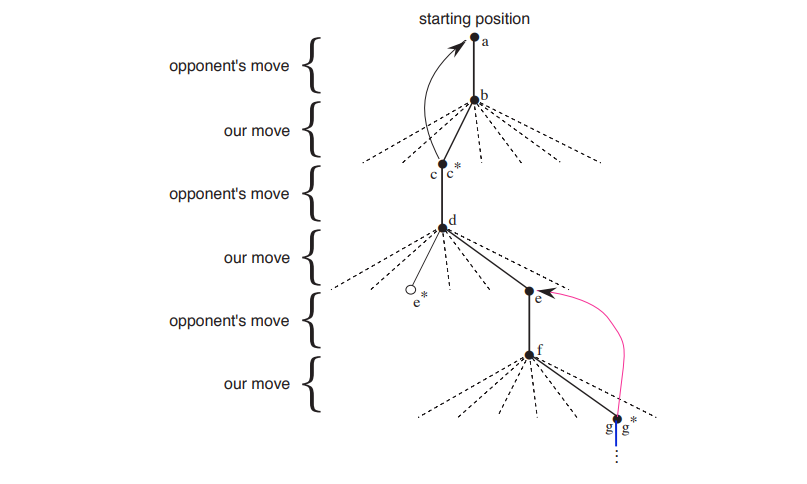

# Chapter 1 The Reinforcement Learning Problem

与其它机器学习方法相比，增强学习是一种注重于从交互中学习、以目标为导向的学习方法。

## Reinforcement Learning

增强学习是一类问题，也是这类问题的解决方法，同时还是研究这类问题和解决方法的领域。

增强学习的问题包括：

- 学习做什么
- 如何完成状态到动作的映射
- 最大化奖励信号

对于一个闭环问题，一个不得不考虑的问题是：学习系统的行为将会影响后续的输入。此外，像其它机器学习方法一样，我们并没有告诉学习系统应该选择哪种行为，只能依靠系统的尝试来选择使奖赏最大的动作。

以上的两个问题，将会导致这样的一个局面：

学习系统当前的行为不仅影响此时的奖赏，还会影响下一次的输入，甚至是影响后续所有的奖赏。

由此增强学习区别于其它学习方法的三个特点是：

- 闭环问题
- 不直接告诉系统选择哪个行为，不说明包括奖励多少在内的行为后果是什么
- 在有限时间内执行

使用马尔科夫决策过程进行最优化控制是增强学习的一个代表性示例。一个待学习的决策机构(agent)如何与周围环境进行互动来完成目标是现实问题面临的最大挑战。显然，一个决策机构必须能够在一定程度上感知环境状态，并且能够采取行动来影响环境。同样，决策机构必须知道它的目标以及这个目标所对应的环境状态。马尔科夫公式必须包括——感知、行为、目标——这三个基本要素。

增强学习不同于当前最火热的监督学习。监督学习是有标签的学习。每一个训练数据都必须有它所对应的真实值。但是对于交互式问题并不适用，因为我们没有办法给出在当前环境下最合适的行为是什么。为了获得最大利益，决策机构只能根据经验判断当前最好的行为是什么。

增强学习也不同于无监督学习。无监督学习是从无标签数据中找到隐藏的结构。虽然在增强学习中，隐藏的结构也起到了一定的作用，但是这些隐藏的结构并没有解决最大化奖赏的问题。

因此，增强学习独立于监督学习和无监督学习。

只存在于增强学习且越来越不可忽视的问题是关于探索与利用的平衡问题。为了获得最大的奖赏，决策机构必须要找到最合适的方案，但最合适的方案可能并没有出现在以前的方案中，所以决策机构必须要制定最合适的方案，而不是直接利用以前的方案。决策机构要尝试不同的方案并逐步调整来达到最好。对于一个随机任务，每一次的行动都要尝试许多次，以此来保证有较大把握获得预计的奖赏。

另一个增强学习的关键因素是与未知环境进行交互的、以目标为导向的决策机构需要考虑问题的全部过程。虽然其它方式也得出了许多有用的结论，但是它们致力于解决子问题而不关注整个问题本身，这是一个极大的限制。

## Example

- 一个高明的棋手下棋，取决于两个方面：规划和直觉
- 一个实时调整石油精炼厂参数的自适应控制器。它自动根据边际成本来控制生产、成本、品质这三者之间的平衡，而不需要工程师的设定。
- 小牛在出生后几个小时就站起来。一个半小时后小牛就能以每小时20英里的速度奔跑
- 清洁机器人决定是进入到新房间清扫还是回去充电。它根据当前的电量状况和以前充电的难易程度决定。
- Phil准备早餐。即使是这样一个平常的行为，也揭示了一个条件行为和连锁的目标—子目标之间关系的复杂交织：走向食物柜，打开，选择一个谷物箱，然后伸手去拿，抓住，再放回箱子。要拿到一个碗、勺子和牛奶瓶需要其他一连串复杂、协调、相互影响的行为。每个步骤包括了一连串眼睛的移动，以获取信息并指导伸手和移动。我们要快速做出判断，如怎样抓住物品或者是否先将其中一些物品放到餐桌上然后再去取其他物品会更好一些。每个步骤都是受目标指导的，如抓住一个勺子或者是走向冰箱，并且为其他目标服务，如一旦麦片准备好了就用勺子吃饭并最终获取营养。无论他是否意识到这些，Phil都是根据它的身体信息来决定他的营养需求、饥饿程度和食物喜好。

对于上述例子，决策机构(agent)总是使用以前的经验来改进它的性能。棋手提高他的判断能力来提高他的棋力；小牛学会站立从而能够奔跑；Phil知道如何做他的早餐。决策机构在一开始就知道目标是什么，通过以前的经验或者自己寻找规律，来决定什么是有用的或者什么是容易学习的。对于调整策略找到任务的特殊之处来说，与环境的互动是非常基本的。

## Elements of Reinforcement Learning

通过以上所述，我们可以知道增强学习的四个要素是：

- 策略 (policy)
- 奖赏信号(reward signal)
- 值函数(value function)
- （可选）环境模型(model of the environment)

### 策略 (policy)

策略定义了待学习的决策机构在给定时间内的行为方式。简单来说，策略就是接收到的环境状态到对应这些状态的映射。在一些情况下，策略可能是一个简单的函数或者是一张查找表。其他情况，如搜索过程，可能还包含大量的运算。在某种程度上说，策略是增强学习决策机构的核心，它自己就可以决定行为。一般来说，策略可以是随机的。

### 奖赏信号(reward signal)

奖赏信号定义了增强学习问题的目标。每一步，环境都会向决策机构发送一个数，这个数就是奖赏(reward)。决策机构的唯一目标就是在长时间运行中最大化收到的奖赏。对于决策机构来说， 奖赏信号被看作是好事或坏事。对于生物体，我们可以把奖赏看作是高兴或是痛苦。因此，产生奖赏的过程不能被决策机构干扰。决策机构只能通过行动直接改变或间接改变环境的状态，以此来影响奖赏的生成过程。

### 值函数(value function)

值函数明确了在整个过程中什么是有用的。粗略的说，一个值是从开始到未来的过程中累加的奖赏。奖赏决定了环境状态的好坏，值揭示了未来的回报。比如，在一个状态下，奖赏很低，但是值可能非常大。后续的状态产生了非常大的奖赏。反过来也成立。

### 环境模型(model of the environment)

环境模型主要是模拟环境的行为。更具体地说，环境模型可以推断出环境是如何表现的。例如，给定一个状态和动作，这个模型可以预测出下一个状态和动作。基于模型的方法(model-based methods)是通过使用环境模型来解决增强学习问题，与之相对的是无模型方法(model-free methods)。现代增强学习经历了从低水平的试错学习到高水平的慎重规划。

## Limitations and Scope

大部分增强学习围绕着如何建立一个合适的值函数，但也不是必须这样。比如，将遗传算法、退火算法应用到增强学习，这是就不必建立值函数。这些方法评估那些没有学习的决策机构的活动，使用不同的策略与环境进行交互，最后选择一个最大的奖赏。如果策略空间足够小，或者容易找的一个足够好的策略，进化方法将是非常有用的。另外，进化方法还可以应用在决策机构不能够准确判断环境状态的问题上。

进化算法也存在以下缺点：进化算法忽视了增强学习问题中有用的结构：它们不考虑从状态的行为的策略；它们不关心哪些状态存在于整个生命周期，以及哪些行为被选择。

有一些算法，如策略梯度法(policy gradient methods)，不需要值函数。它们直接评估调整哪些参数可以快速提高算法的性能。与进化算法不同，它们在决策机构与环境交互时进行评估，因此，它们利用交互的细节。

值得注意的是，决策机构的目标是最大化奖赏，但并不是坚持达到最大化。关键在于增强学习尝试增加接收到的奖赏的数量。

## An Extended Example: Tic-Tac-Toc

我们首先使用进化算法来解决这个问题。进化算法直接在策略空间中寻找获胜概率最高的策略。每评估一次，都要统计在多次游戏中，计算战胜对手的概率。评估的结果直接影响下一次所使用的策略。典型的进化算法将会不断搜寻策略空间，不断评估所选择的策略，来达到提高性能的目的。

接下来是使用值函数的方法来玩井字棋游戏。首先我们建立一张表，表中的每一项都是游戏可能的状态。每个数字都是我们从该状态获胜概率的最新估计。我们把这些估计看作是状态的值，整张表就是学习到的值函数。如果我们从A状态获得的当前估计比B高，那么我们就认为A的值比B高。换句话说，A比B要好。

为了选择下一步怎么走，我们检查每一步可能出现的状态，并与当前的值进行比较。大部分时候我们选择“贪婪”走法， 即选择出现的最大值。但是，偶尔我们也会从其它走法中随机选择一种走法。这种方式被称为探索(exploratory)。这样做得原因是可以遍历我们没有考虑的状态。如下图所示：

随着游戏的进行，我们逐渐改变状态的值。我们试图获得更准确的获胜概率。为此，在进行下一步之前，我们备份每一次贪婪选择之后的状态的值。更确切的说，我们需要调整先前状态的值，使它接近以后状态的值。公式如下：

$$ V(s) \leftarrow V(s) + \alpha [V(s') - V(s)]  \tag{1.1}$$

$s$是现在的状态，$s'$是接下来的状态，$V(a)$代表$a$状态的估计值，$\alpha$是步长。

这个例子揭示了一些增强学习的关键特性：

1. 强调与周围环境的交互。在本例中指的是对手。
2. 有着清晰的目标，有着正确行为的规划以及对后续结果的考虑。

### Exercise 1.1: Self-Play

Q: 假设是增强学习的自我对抗，会出现什么情况？会不会出现不同的策略？

A: 可能最后只出现一种情况——平局。可能会出现不同策略。

### Exercise 1.2: Symmetries

Q: 如何利用对称来改进算法？如何改进？如果对手没有利用对称，我们将会怎样？如果考虑对称，对称的位置是否有相同的值？

A: 可以使用对称性来减少内存的使用。如果我们考虑对称而对手未考虑，那么我们的选择会比对手要少。换句话说，对手更可能获胜。对称位置不一定有相同的值。

### Exercise 1.3 Greedy Play

Q: 假设增强学习总是选择贪心走法，与非贪心走法的玩家相比，更坏还是更差？又会出现什么问题？

A: 更坏。贪心走法选择的是局部最优解，但是局部最优解的累加不一定是全局最优解。如天龙八部在描写如何破解珍珑棋局时，虚竹以退为进。显然如果采用贪婪算法，并不能获得实际最大收益。

###Exercise1.4: Learning from Exploration 

Q: 如果步长参数随时间推移而适当地减少，那么所有的状态值都将收敛到一个概率集合。我们有两种选择：从探索性走棋中学习以及不从探索性走棋中学习，那么这两组概率应该如何计算呢？假设我们不断地进行探索性走棋，哪个概率集合可能学习得更好？哪个能带来更多的胜利？

A: 这个问题我没有思路

###  Exercise 1.5: Other Improvements

Q: 如何改进增强学习算法？如何更好的解决井字棋问题？

A: 增加探索的次数，一次探索选择多个分支，增大探索深度

