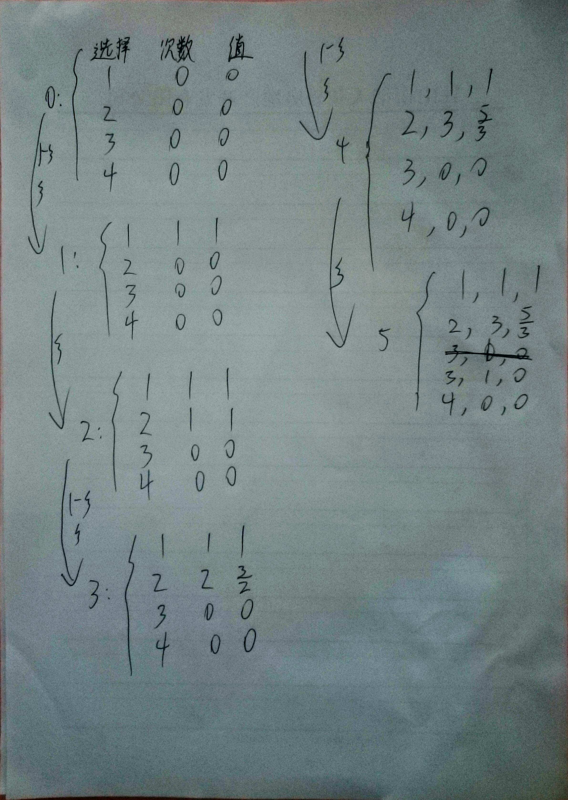
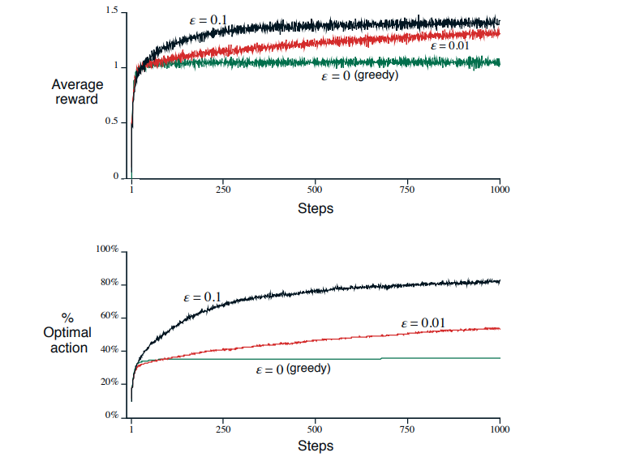
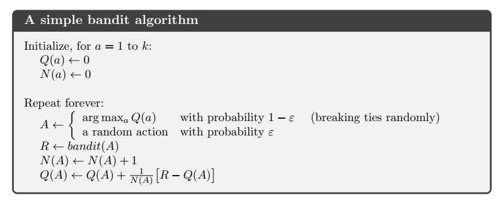
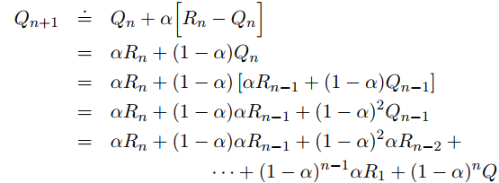
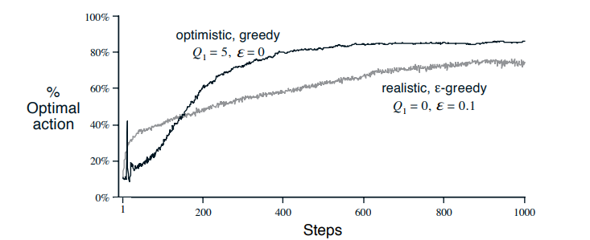
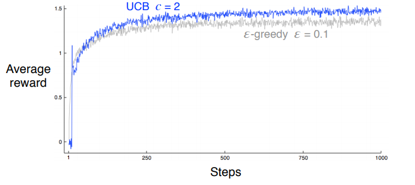
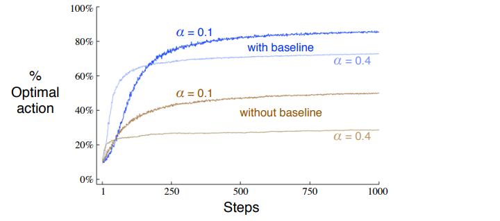

# Chapter 2 Multi-armed Bandits

增强学习与其它学习方法最大的不同在于：增强学习使用训练数据来选择哪个行为应该被采用，其它学习方法是通过给定的行为来构建模型。增强学习的这一特点，引出了这样一个问题，即在一个试错搜索中，对行为的探索应该到达什么地步。

对于评估反馈算法，我们只能知道这个行为的好坏，但我们不知道它是不是最好的（最坏的）。另一方面，对于结构反馈算法，我们只知道当前理论上应该采取什么样的行动，但是我们对实际采取的行动一无所知。

以上两种反馈算法是监督学习的基础。它们有着本质的区别：评估反馈算法完全依赖行为的选择，而结构反馈算法则不考虑行为选择的具体情况。

在本章中，我们将研究在简化模型下增强学习的评估选择。这里，我们只考虑一种行为只在一个位置出现的情况。此外，本章的样本全部是独立分布。

k-臂老虎机问题(k-armed bandit)是一个典型的、独立的、采用评估反馈算法的问题。

## A k-armed Bandit Problem

考虑这样一个问题：你现在重复的从k的选项中，或者说行为中，选择一个。你的每一次选择，你都会得到一个数字。数字越大，表示你获得的奖赏越多。数字的大小完全服从于你选择的行为的概率分布。你的任务是在有限的时间里，使你最后得到的奖赏最大。

最初的多臂老虎机问题(k-armed bandit problem)，又称单臂老虎机。一种选择方式是每一次的选择都像是拉一次老虎机的杠杆，得到的奖励是所击中的奖池。通过不停地重复，你知道不停地拉最大奖赏出现次数最多的杠杆。另一种选择方式就像是医生根据经验治疗患者。每一次的行为选择就像是一张处方，每一次的奖励是病人病情的好坏。这两种选择方式分别对应利用(exploit)和探索(explore)。

在我们所研究的多臂老虎机问题中，默认当我们选择某种行为后，我们就会得到预期奖赏或者是平均奖赏。设，在t时刻的行为是$A_t$，$A_t$对应的奖赏为$R_t$。a代表在t时刻任意的一个可以被选择的行为，a所对应的期望奖赏是$q_*(a)$。

$$q_*(a) = E [R_t | A_t = a] \tag{2.1}$$

在知道每个行为的值之后，解决多臂老虎机问题就会非常容易：我们总是选择最大值对应的行为。现在，我们假设无法确定行为所对应的值，我们现在用在t时刻行为a的估计值$Q_t(a)$来近似的代替精确值$q_*(a)$。

如果我们使用行为的估计值来解决多臂老虎机的问题，那么必然在每一步都会有一种行为它所对应的估计值是最大的。我们称这样的行为是贪婪行为。但你总是选择贪婪行为，那么我们就可以说我们此时利用了当前已知的行为的值。这种做法被称为利用(exploiting)。

如果你在某一步没有选择贪婪行为，这样的做法我们成为探索(exploring)。这样做可以改进非贪婪行为的值的估计。

在每一步，使用利用策略无疑可以使我们最大化奖赏的期望，但是探索策略可以使我们在更远的将来获得更大的奖赏。

本章的任务就是减缓利用和探索的分歧。值得注意的是，虽然有许多方法可以比较好的解决这个矛盾，但实际上是不现实的。因为这些方法需要许多理想化的条件或者是许多先验条件，显然在实际中我们无法满足这些要求。但是在本章的讨论中，这些限制条件可以忽略。

## Action-value Methods

首先，我们使用一些比较简单的方法来估计行为的值，并使用这些值来做出合理的决定。

想一下，我们是如何求出被选择的行为的真实平均值的。一个方法是：

$${Q_t(a)} = \frac{在t时刻以前，行为a的奖赏的和}{在t时刻以前，选择行为a的次数} = \frac{\sum ^{t-1}_{i=1} R_i * 1_ {A_i  = a}} {\sum^{t-1}_{i = 1} 1_{A_i = a}} \tag{2.2}$$

这里，$1_{predicate}$表示某一时刻选择的对应行为。$1_{A_i = a}$表示如果在i时刻选择行为a，那么就返回1，否则返回0。

如果分母是0，那么我们就把$Q_t(a)$手动设为默认值，如$Q_t(a) = 0$。随着分母趋近于无限大，根据大数定理，有$\lim{Q_t(a) \to q_*(a)}$。我们把这种估计行为的值的方法成为样本平均法(sample-average method)。在解决如何估计行为的值这个问题后，现在考虑如何根据估计的值来选择合适的行为。

最简单的方法，贪婪选择法，就是选择最大估计值所对应的行为。公式如下：

$$A_t = \mathop{argmax} \limits_{a} {Q_t(a)} \tag{2.3}$$

这里，参数$argmax_a$的含义为最大估计值所对应的行为。

贪婪选择总是选择当前已知的最大值。这样做的缺点如上所述，就是不知道未来的发展。一种改进的策略是$\epsilon-greedy$方法，这种方法以概率$1 - \epsilon$的方式选择贪婪行为，即利用；以概率$\epsilon$的方式从所有行为中任选一个，即探索。这样，随着选择次数的增多，以至于到无限，就有$Q_t(a) \to q_*(a)$。

### Exercise 2.1

Q: 使用$\epsilon - greedy$方法，在$\epsilon = 0.5$，每个位置只有两种情况下，选择贪婪行为的概率是多少?

A: 

1. 一般情况下，选择贪婪行为的概率是大于0.5
2. 特殊情况下，即在某个位置两种行为的估计值相同，选择贪婪行为的概率是1

### Exercise 2.2: Bandit example

Q: 现在有一个4臂老虎机，对应4个位置——1，2，3，4。使用采样平均算法对行为进行评估，使用$\epsilon - greedy$算法进行行为选择。设，$t = 0$时，$Q_0(a) = 0, \forall a$。现在有序列：

1. $A_1 = 1, R_1 = 1$
2. $A_2 = 2,R_2 = 1$
3. $A_3 = 2, R_3 = 2$
4. $A_4 = 2,R_4 = 2$
5. $A_5 = 3,R_5 = 0$

在以上哪个时刻，以概率$\epsilon$选择行为？哪些时刻一定出现？哪些时刻可能出现？

A: 

添加条件：如果最大值对应多个行为，则在这多个行为中任选一个。

1. 可能出现的时刻：

   ​	分析：如果$\epsilon$情况发生，那么所有的行为（包括贪婪行为）在内都有可能被选择。

   ​	结论：1，3，4

2. 一定出现的时刻：

   ​	分析：在某一时刻t，只有一个最大值，这个最大值对应的行为是a，但是在下一时刻，未选择a。

   ​	结论：2，5

## The 10-armed Testbed

现在我们通过2000个10臂老虎机来比较greedy算法和$\epsilon - greedy$算法。每台老虎机玩1000多次。

现在我们对贪婪算法，0.01 - greedy算法，0.1 - greedy算法进行比较。结果如图所示：

### Exercise 2.3

Q: 从长期来看，哪种算法可能获得最大的奖赏，最可能选择最优行为？能好多少？

A: 

> The ε = 0.1 method explores more, and usually finds the optimal action earlier, but never selects it more than 91% of the time.

> The ε = 0.01 method improves more slowly, but eventually would perform better than the ε = 0.1 method on both performance measures.

$\epsilon = 0.01$这个算法可能更好，最优选择率可能超过91%。

## Incremental Implementation

有式子2.2可知，为了计算$Q_n$，我们必须记录下每次该行为所获得奖赏。这种做法效率不高。我们完全可以利用以下式子求解：

$$Q_{n + 1 } = \frac {R_1 + · · ·  + R_n} {n} = \frac {(n - 1) * Q_{n} + R _n} {n} = Q_n + \frac{1}{n}(R_n - Q_{n}) \tag{2.4}$$

式子2.4只需要$Q_n$和$n$即可求解，这无疑会大大加快效率。

一个简单的老虎机算法如下：

但是我们可以从另一个方面来看待式子2.4。$R_n$代表此次获得的奖赏，$Q_n$则是奖赏的期望。$R_n - Q_n$代表期望与实际的差距。$\frac{1}{n}$可是看作是对这个差距的重视程度，可以称它为权重参数。增强学习的难点在于某种行为在不同时刻或位置起到不同的作用。所以我们希望存在这样一种算法：它保证在有限时间内，某个操作获得的奖赏趋于稳定，这样我们就可以对未来的预测也就更加准确。

## Tracking a nonstationary Problem

以上，我们都是在一个稳定的环境下进行的讨论。但是这样的环境在实际中是不太可能存在的。比如，对于当前时刻t，离t时刻较近的奖赏更可信一些，离t时刻较远的奖赏作为参考的价值则不大。这样的变化可以通过动态改变式2.4的权重参数来实现。如下图：

最后可得

$$Q_{n + 1} = (1 - \alpha)^n Q_1 + \sum _{i = 1} ^ {n} \alpha (1 - \alpha)^{n - i} R_i \tag{2.5}$$

我们注意到，$Q_n(a) \to q_*(a)$的前提是满足大数定理(the law of large numbers)。所以对于序列${ \{ \alpha _n {(a)} \}}$，要保证以下两个条件：

$$\sum _ {n = 1} ^{\infty} \alpha _ {n} (a) = \infty \ \ \ \ \ and \ \ \ \ \sum _{n = 1}^{\infty} \alpha _{n} ^ {2} (a) < \infty \tag{2.6}$$

第一个条件保证步伐足够大，来避免其它因素的干扰。第二个条件保证步伐足够的小，以保证能够收敛。

### Exercise 2.4

Q: 如果参数权重是动态改变的，那么根据式2.5，它是如何变化的？

A: 如式2.5所示，$R_i$的权重参数为$ {\alpha} {(1 - \alpha) ^ {n - i}}$，$Q_1$的权重为$(1 - \alpha) ^ n$。

## Optimistic Initial Values

根据式2.5，我们设定的初值随着训练次数的增多影响不断减弱。从统计学上来讲，我们设定的初值影响了我们对未来的估计。但从实际来说，这种影响不是一个问题，反而对我们还会起到一定的帮助。

下面我们来讨论不同初值对算法的影响。我们以10臂老虎机作为实验样本。使用贪婪算法和$\epsilon-greedy$算法进行测试。将贪婪算法的初值设为+5，将$\epsilon-greedy$算法的初值设为0。结果如下图：

我们看到贪婪算法的效果更好，这种技术称为最优初值算法(optimistic initial values)。

### Exercise 2.6: Mysterious Spikes

Q: 贪婪算法的早期阶段，是什么因素导致曲线的震荡？换句话说，什么因素会影响算法早期阶段的表现？

A: 设置的初值导致曲线在早期震荡

## Upper-Confidence-Bound Action Selection

 $\epsilon-greedy$算法不加选择的、随机的从所有行为中选取一个进行探索，这无疑会带来很大的浪费。我们应该选择那些潜在的、可能带来更大价值的行为进行探索。一个有效的方式是：

$$ {A_t} = {\mathop{argmax} _\limits{a}}  [ Q_t(a) + c \sqrt(\frac{\log t} {N_t(a)})] \tag{2.7}$$

其中$\log t$表示$t$的自然对数；$N_t(a)$表示在t时刻之前选择行为a的次数，如果$N_t(a) = 0$，那么a被看作是最有可能带来最大值的行为。c是一个大于0的常数，控制探索的程度。

这种方法——上置信区间选择法(upper confidence bound, UCB)，是用来评估估计值不确定性的一种方法。每次行为a被选择后，它的估计值就越趋近一个常数。使用自然对数意味着随着测试的进行，增速越来越慢，但是没有边界。最终所有的行为都会被选择，但是有的行为被选择的次数不多，这意味着它的估计值很低，或者它在之前已经被选择很多次了。

下图是UCB算法和$\epsilon-greedy$算法的比较。如图所示，UCB算法更好一些。但是UCB算法在不稳定环境下的表现很差。所以在实际应用中，UCB算法不如$\epsilon-greedy$算法。

## Gradient Bandit Algorithms

本节来讨论一种新的估值算法。现在，我们引入一个参数$H_t(a)$，这个参数表示行为a的权重。这个参数越大，对应的行为被采用的次数越多。值得注意的是，这个参数与获得的奖赏无关，它的含义是该行为与其它行为的比较。它的表达式如下：

$$Pr \{A_t = a \} = \frac{e^{H_t(a)}} {\sum_{b = 1}^{k} {e ^{H_t(b)}}} = \pi_{t}{a} \tag{2.8}$$

在开始的时候各行为被等概率的选取。

### Exercise 2.7

Q: 在只有两种行为的情况下，证明softmax分布和logistic(或sigmoid)分布相同

A: 这个证明太繁琐了，我时间不太够，就没做

下面是根据随机梯度下降法对$H_t()$进行更新的公式：

$$H_{t +1 }(A_t) = H_t(A_t) + \alpha (R_t - \overline{R}_t)(1 - \pi_t(A_t))\tag{2.9}$$

且

$$H_{t+ 1}(a) = H_t(a) - \alpha(R_t - \overline{R}_t) \pi_t(a) \ \ \ \ \ \forall a \neq{A_t} \tag{2.10}$$

$\alpha > 0$，控制步长；$\overline{R}_t$是包括t时刻在内的奖赏的平均值。$\overline{R}_t$是奖赏之间进行比较的标准，如果当前行为的奖赏低于标准线，那该行为被选择的可能性就会降低，其它行为被选择的可能性就会增大。

下图是梯度法在老虎机问题上的的表现。如图所示，奖赏的整体变化对梯度法的表现无影响。如果标准$\overline{R}_t = 0$，那么梯度法的表现就很差。

**剩下的随机梯度法我没看懂，总感觉它的推导省略了一些东西**

##关联搜索(Contextual Bandits)

关联搜索是介于多臂老虎机问题和真正的增强学习问题之间的一种问题。我觉得关联搜索是建立起奖赏和行为之间的映射关系。