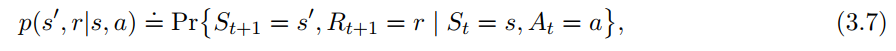
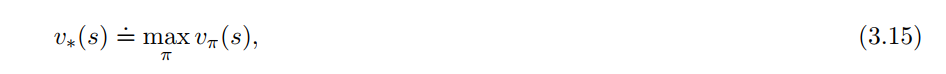
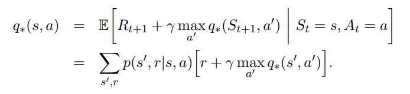

# Chapter 3 Finite Markov Decision

## The Agent-Environment Interface

增强学习问题是这样一类问题：不断从与环境的交互中学习经验，最终完成目标。学习与决策由一种被称为智能体(agent)的机构进行。与智能体进行交互、除智能体以外的事物被称为环境(environment)。

智能体根据环境的状态选择一个合适的行为(action)，环境针对该行为做出相应的变化，并产生一个特殊的值。这个值被称为奖励(reward)。智能体接受环境的新状态和奖励，做出新的选择，朝着最大化奖励的方向努力。

下图是整个过程的示意图。

值得注意的是，从状态到行为的映射被称为策略(policy)。用记号$\pi_t$表示，${\pi _ t}{(a|s)}$表示在t时刻，环境状态为s的情况下，选择行为a的概率。

事实上，智能体和环境之间并没有一条十分明显的分界线。一般来说，不能被智能体任意改变的事物都可以被看作是环境。智能体——环境的分界线表达的是智能体可以绝对控制的极限，而不是可知的极限。

实际上，以目标为导向的问题都可以简化为三个在智能体和环境之间相互传递的信号：一个信号表示智能体所做的选择；一个信号表示环境的状态；一个信号表示奖励。

### Example 3.1: Bioreactor

现在使用增强学习控制生物反应器的温度和搅拌速率。可选择的行为有使用加热器和电机来调整温度和搅拌速率。获得的奖励是在某一时刻容器内的化学反应速率。这是一个典型的增强学习任务：状态和行为都是结构化的表达式，而奖励则是一个数字。

### Pick-and-Place Robot

现在使用增强学习来控制机器人的手臂来完成拾起-放下任务。如果我们想要使机器人的动作快速而优雅，智能体就必须尽快的做出决策同时尽快的获得相关信息，同时环境给出的奖励应该是负数。增强学习的行为可能是加在关节电机的电压大小。如果成功的拿起放下，就可获得奖励+1。

### Example 3.3: Recycling Robot

有一个机器人从周围收集空瓶子。现在基于机器人的电量，应用增强学习，决定机器人下一步的动作（即智能体可选择的行为）：

1. 在一段时间内去寻找空瓶子
2. 等待，如果发现空瓶子，就捡起来
3. 返回充电

智能体大部分时候在环境中获得奖励为0，但如果捡到空瓶子就可获得正的奖励。如果电池没电，智能体就会得到一个相当大的负的奖励。

### Exercise 3.2

Q: 增强学习能不能代表所有的以目标为导向的学习任务？反例？

A: 不能。如果在某个状态的奖励是空，增强学习就无法判断下一步应该如何进行。

## Goals and Rewards

不正式的说，智能体的目标是最大化接收到的奖励的总额。正式的表述如下：

> 我们的目标或者意图是：最大化接收到的累计奖励的期望

使用奖励信号来形式化目标是增强学习最显著的特性之一。

我们设置的奖励真实的反映了我们的意图。奖励信号的设置，反映的是你希望机器人去做什么，而不是告诉机器人如何去做。

最后，智能体的终极目标应该是建立起一套完美的决策系统，而不是随意的改变行为来获得奖励。

## Returns

现在有一个分时系统，我们把时段t之后获得的奖励标记为$R_{t+1}, R_{t+2},  . . .$。一般的，我们寻找最大返回期望，用$G_t$表示。最简单的方式是：

这里$T$是最后一个时间段。

如果这个交互过程可以分为几个子过程，每个子过程的初始状态相同。这样我们把每个子过程称为一个周期(episodes)，把每个周期结束对应的状态称为终结状态(terminal state)。每个子周期的终结状态可能不同，但我们可以把它们看作一种状态，使用不同的奖励加以区分。

另一种情况，这个智能体-环境交互系统是一个完整的个体，无法将它人为的分为几个子周期。如果任务是在这样的情形下完成，我们称这样的任务为连续任务(continuing-tasks)。

对于连续任务，我们还要提的一个概念是折扣(discounting)。它的表达式如下：

$\gamma$即折扣率，它的取值为$[0, 1]$。

如果$\gamma  < 1$，在奖励序列$\{R_k\}$有界的条件下，这个级数的和将收敛于一个常数；如果$\gamma = 0$，那么这个智能体的目标就是对每一次的状态都选择贪婪行为；如果$\gamma = 1$，智能体更加重视未来的回报。

### Example 3.4: Pole-Balancing

小车在轨道来回移动来维持绑在小车上的杆的平衡。如果小车驶离轨道，或者杆的角度超过给定的最大角度，那么任务失败。每次失败后，杆都会恢复竖直状态。

这个任务可以看作是周期任务，每次的任务都是维持杆的平衡。在一个周期的各个时间段内，如果某个时间段任务没有失败，则奖励为+1。

这个任务也可以看作是连续任务。在这样的前提下，在每个时间段内，如果任务没有失败，则奖励为0；否则为-1。这样每次返回的奖励是$-{\gamma}^{K}$，K是失败之前的时间段的个数。

以上两种情况，智能体的目标都是尽可能延长杆平衡的时间。

### Exercise 3.4

Q: 把杆平衡问题看作是带有折扣的周期问题。如果失败，奖励为-1；否则，为0。在每个时间段会返回什么？它的返回与带有折扣的连续任务有何区别？

A:

1. 返回的期望是$-{\gamma}^{K}$，K是失败之前的时间段的个数。
2. 对于周期任务，每次失败后都初始化为初始状态；对于连续任务，每次失败后（即杆的角度超过最大限度），都有可能恢复。也就是连续任务返回的期望是${\sum}{- \gamma^k}\ \ \ {k = \{k1,k2,……\}}$。

### Exercise 3.5

Q: 现在有一个迷宫。如果机器人逃离迷宫，奖励为+1；否则为0。结果显示效果不理想。哪里出现了问题？如何改进？

A：

- 奖励设置出现问题。除逃出迷宫外，其它奖励都是0。这表示机器人选择任意方向都可以。如果机器人在最南边，选择向南获得奖励实际上应该比其它方向的奖励要少。但按照题中所述，奖励都是一样的。
- 一个改进是如果机器人不能向某个方向移动，那么其它方向的奖励就要增大。

对于连续任务，它的期望返回可以写成递归形式，如下所示：

### Exercise 3.6

Q: 设$\gamma = 0.5$，接收到的奖赏序列为：R1 = -1, R2 = 2, R3 = 6, R4 = 3 R5 = 2, T = 5。求G0, G1, ……, G5

A: 

​	G5 = 5, G4 = 9/ 2, G3 = 21/ 4, G2 = 69 / 8, G1 = 101 / 16, G0 = 69 / 32

根据式3.2，如果得到的奖赏是一个非零的常数，那么式3.2收敛为一个有限的数。例如，如果接收到的奖励总为+1，那么得到的返回为：

### Exercise 3.7

Q: 设$\gamma = 0.9$的无限序列，接收到的奖励总为2。求G0和G1的值。

A: G0 = G1 = 20

## Unified Notation for Episodic and Continuing Tasks

现在我们要建立起一个能够把周期任务和连续任务统一起来的模型。下图是模型图：

如图所示，我们从S0开始，获得的奖励序列依次为+1, +1, +1, 0, 0, 0, ……。把它们求和，无论是只计算前T（这里，T = 3）步还是整个无限序列，得到的值都一样。即使是引入折扣(discounting)也如此。因此在可能的情况下，期望的返回可以写成：

注意$T = \infty$和$\gamma = 1$不能同时存在。

## The Markov Property

这里，“状态”是指智能体可得到的任何信息。

一般来说，环境的改变只与先前发生的事件有关。这样，下一个状态及可能获得的奖励可用下式表示：

这里，$s'、r$分别代表下一个可能的状态和可能的奖励。S0, A0, R1, ……, Rt, St, At分别代表以前事件的值。

如果某个状态信号具有马尔科夫特性，那么它必然满足下式：

也就是，下一个状态只与当前状态有关，与更遥远的状态无关。

这样，我们就可以不断通过递归来推测未来可能得到的奖励，从而选择最优策略。

### Example 3.5: Pole-Balancing State

在先前介绍的杆平衡任务，如果我们能够获得一切所需要的量，如小车速度、杆的角速度等，我们就可以认为这个任务具有马尔科夫特性。实际上，由于系统的误差、温度及其它因素，我们不可能精确地测定我们所需要的物理量。因此，实际上，杆平衡任务并不能严格满足马尔科夫特性。

但是，如果我们把小车的位置大概的划分为右、左、中。这个任务就可以使用增强学习来解决。事实上，这样可以使智能体更快速的学习，忽略那些无用的因素。

### Example 3.6: Draw Poker

现在我们来玩抽扑克的游戏。

在这个任务中，每个玩家获得的状态信号是不一样的。每个玩家只知道自己手中的牌，然后去猜其他玩家的牌。还有，这个游戏的状态信息应该包括赌注和被其他玩家抽到的牌的数目。

即使我们获得了其它玩家可能持有的牌的信息，事实上，我们仍然无法做出准确的判断。毫无疑问，扑克决策的过程毫无疑问不具备马尔科夫特性。

由此，我们得出结论：一个任务的状态表达式如果不具备马尔科夫性质，那么它就不能通过增强学习来解决。

### Exercise 3.8: Broken Vision System

Q: 假设你有一台照相机，你拍了一张照。在拍完照之后，环境是否具有马尔科夫状态？再假设，拍完这张图片后，相机坏了，花了一天才修好。这时是否还具有马尔科夫状态？

A：在拍完图片后，环境具有马尔科夫状态。过了一天后，就没有了。

## Markov Decision Processes

满足马尔科夫性质的增强学习任务被称为马尔科夫决策过程(Markov decision process, MDP)。如果状态空间和行为空间都是有限的话，这样的任务被称为有限马尔科夫决策过程(finite Markov decision process, finite MDP)。

给定状态s和行为a，下一个状态是$s'$、奖励是$r$的概率可以用下式表示：

通过式3.8，我们可以计算在给定的行为下，接收到的奖赏的期望是：

状态转移概率：

在指定当前状态、行为、下一状态的情况下，奖励的期望：

### Exercise 3.9

Q: 如果当前状态是$S_{t}$，使用随机政策$\pi$来决定行动，那么$R_{t+1}$的期望是什么？

A: 设$\pi(s|a)$表示在政策$\pi$下，对于状态s，选择行为a的概率。

$R_{t+1} =\sum \pi(s|a) \sum{r} \sum p(s',r|s,a)$

### Example 3.7: Recycling Robot MDP

现在我们把例3.3简单的扩展为一个有限的MDP过程。根据外部事件，智能体的行为有：

1. 主动搜索空罐子
2. 停止等待
3. 回去充电

最好的方案是主动搜寻空罐子，但是这会消耗电能；停止等待则不会耗电。无论何时机器人去搜索，都有可能出现电量被耗光的情况。

智能体根据电量的剩余情况做出确定。电量剩余可能出现两种情况：高、低。智能体的选择可能有：等待、搜索和充电。下图是状态对应的行为：

在电量剩余为高的情况下，主动搜索显然没有电量耗尽的风险。在进行一段时间的搜索后，电量剩余为高的概率为$\alpha$，剩余为低的概率为$1 - \alpha$。如果在电池剩余为低的情况搜索，仍为低的概率是$\beta$，电量耗尽的概率为$1 - \beta$。在电池耗尽的情况下，机器人必须充电，所以它下一个电量使用情况是高。每收集一个空罐子，奖励+1，如果被拯救，奖励设为-3。设定搜寻的奖励期望($r_{search}$)大于等待的期望($r_{wait}$)。由此可得状态转换和奖励期望如下图所示：

下图是转换图。图中共有两个节点：状态节点和行为节点。状态节点是大的空心圆，行为节点是小的实心圆。

### Exercise 3.10

Q: 将表3.1的$p{(s'|s,a)}$改为${p}{(s',r|s,a)}$，重写表3-1

A:

说明：

- $r_{search}​$是指在搜索过程中捡到的罐子数，$p_{search}​$是${r_{search}}​$对应的概率
- $r_{wait}$是指在等待过程中捡到的罐子数，$p_{wait}$是${r_{wait}}$对应的概率

| $s$  |   $a$    | $s'$ |     $r$      |      ${p}{(s',r|s,a)}$      |
| :--: | :------: | :--: | :----------: | :-------------------------: |
| high |  search  | high | $r_{search}$ |    $\alpha * p_{search}$    |
| high |  search  | low  | $r_{search}$ | $(1 - \alpha) * p_{serach}$ |
| low  |  search  | high |      -3      |         $1 - \beta$         |
| low  |  search  | low  | $r_{search}$ |    $\beta * p_{search}$     |
| high |   wait   | high |  $r_{wait}$  |         $p_{wait}$          |
| high |   wait   | low  |  $r_{wait}$  |              0              |
| low  |   wait   | high |  $r_{wait}$  |              0              |
| low  |   wait   | low  |  $r_{wait}$  |        ${p}_{wait}$         |
| low  | recharge | high |      0       |              1              |
| low  | recharge | low  |      0       |              0              |

## Value Function

每一种增强学习算法都包含价值函数。价值函数(value function)评估状态的好坏。状态的好坏指的是未来奖励期望的大小。显然，智能体未来接收到的奖励与什么样的行为被选择有关。

${v}_{\pi}{(s)}$表示从状态s开始，使用策略$\pi$，未来会获得的奖赏期望。可表示为：

类似的，${q}_{\pi}{(s,a)}$表示从状态s开始，选择a行为，使用策略$\pi$，未来会获得的奖赏期望。可表示为：

价值函数的一个基本特点是它满足递归关系。对于状态s的值与s之后的状态的值存在这样一个关系式：

式3.14被称为贝尔曼等式(Bellman equation)。

### Example 3.8： Girdworld

下图是一个简单的有限马尔科夫决策过程。每一个格代表环境的一个状态。对于每个状态，有四个行为可供选择：东、南、西、北，选择任意行为的概率相同。如果在选择某一行为后，位置没有改变（还在原来的格里面），就会获得-1的奖励。如果在状态A，那么就会被移到$A'$这个位置，奖励为+10；如果在状态B，那么就会被移到$B'$这个位置，奖励为+5；其它情况的奖励是0。

右图是每个格在$\gamma = 0.9$下的值函数。注意到，负值多半是在边缘区域，因为边缘区域更易碰壁。状态A的期望返回小于10，这是因为$A'$容易碰壁。状态B的期望返回大于5，这是因为在$B'$这个位置不易碰壁。

### Example 3.9: Golf

对于打高尔夫这个任务，我们设定每挥杆一次，得到的奖励为-1。状态是球所在的位置。状态的值是在进洞之前的挥杆次数。对于每个状态，我们的行为有两种：推(putter)和打(driver)。

下图是只考虑推杆的状态的值。绿色区域我们能够直接挥杆进洞，这些状态的值是-1。非绿色区域我们不能直接一杆进洞，所以它们状态的值要更小。对于沙坑，推杆不能把球打出去，因此它的奖励是负无穷。

总之，从发球点挥杆，到进洞，需要6杆。

### Exercise 3.11

Q: 写出$q_{\pi}$的贝尔曼等式

A: $q_{\pi}{(s,a)}  = \sum_{s',r} {p(s',r|s,a)} [r + \gamma {q_{\pi}{(s', a')}}]$

## Optimal Value Functions

增强学习的主要问题是寻找一个能够在未来获得最大奖励的策略。可以证明，总是有一条策略$\pi_{*}$，要好于或等于其它策略。我们把策略$\pi_{*}$称之为最优策略。

因此，最优状态值函数(optimal state-value function)可以定义为:

同样，最优行为值函数(optimal action-value function)可定义为：

或者

### Example 3.10: Optimal Value Functions for Golf

上图是如果我们第一杆选择击球，随后选择击球或推球，这样的一个状态的值的分布。击球可以飞的更远，但准确性更差。所以如果选择击球的话，那就必须在离洞非常近的情况下才能一杆进洞。我们可以很明显的看出-1分界线所包围的区域要比绿色区域要小。如果我们要打两球，就必须从绿色区域以外的地方开始，且第一杆必须把球打到绿色区域内。如果要三杆，最好的行为序列是：击球、击球、推球。

状态值与行为值之间的联系是：状态值是所有行为值最大的那一个。数学推导如下：

其中最优行为值函数为：

### Example 3.11: Bellman Optimality Equations for the Recycling Robot

机器人的状态值函数可写成：

和

### Example 3.12: Solving the Gridworld

左图是对问题的描述，中间的图是最优值函数，右图是对应的最优行为。

这个问题依赖三个假设：

1. 我们可以清楚地知道环境的变化
2. 我们拥有足够的计算资源
3. 满足马尔科夫性质

第二个假设最难以克服。如果一个游戏有$10^{20}$种状态，即使使用最快的计算机，也要算上几千年。现在的许多增强学习算法都是对贝尔曼最优式的近似。

### Exercise 3.19

Q: 给出回收机器人$q_{*}$的贝尔曼等式

A:

$ q {(high, search)} ={[(r_{search} + {\gamma}{v_{*}{(high)}}) *  ( {\alpha * p_{search}}) + ( r_{search} + {\gamma}{v_{*} {(low)}}) *  ((1 - \alpha) * p_{search})]}$

$ q{(high, wait)} ={[(r_{wait} + {\gamma}{v_{*}{(high)}}) *  ( p_{wait})]}$

$ q {(low, search)} ={[(r_{search} + {\gamma}{v_{*}{(low)}}) *  ( {\beta * p_{search}}) + ( -3 + {\gamma}{v_{*} {(high)}}) *  (1 - \beta) ]}$

$ q{(low, wait)} ={[(r_{wait} + {\gamma}{v_{*}{(low)}}) *  ( p_{wait})]}$

$ q {(low, recharge)} ={[{\gamma}{v_{*}{(high)}})]}$

$$q_{*} = {\max}\ {q(s,a)}$$

### Exercise 3.21

Q: 如图所示，在$\gamma = 0, \ 0.9, \ 0.5$下，$\pi_{left}$和$\pi_{right}$哪个策略好？

A: 

$$\pi_{left} = [1 + \gamma * 0] = 1$$

$$\pi_{right} = [0 + \gamma * 2] = 2\gamma$$

在$\gamma = 0.5$时，左右政策评估结果相同；$\gamma = 0$，$\pi_{left}$更好；$\gamma = 0.9$，$\pi_{right}$更好

## Optimality and Approximation

虽然我们可以通过贝尔曼等式来找到最优值和最优政策，但是我们在实际中很少使用这种方法。正如例3.12所述，庞大的计算开销是主要原因。

此外，为了计算值函数、评估策略和模型，我们还需要极大的内存空间。

为了解决以上两个问题，我们只能通过近似来进行有限度的处理。

