# Chapter 4 Dynamic Programming

在给定的环境模型下，对于马尔科夫决策过程，动态规划算法(Dynamic Programming, DP)是一种很好的寻找最优决策的算法。但它的局限在于，它需要构建一个完美的环境模型以及非常大的计算资源。这两个原因导致动态规划算法几乎不能在实际中运用。事实上，其它算法的目标都是到达动态规划算法的效果，只不过是降低对环境模型的要求或计算资源的消耗。

动态规划算法的关键，在于使用值函数来组织和构建策略的搜索。状态s的值函数指的是在状态s后获得的奖励的期望。值函数的定义式为(Bellman equations)：

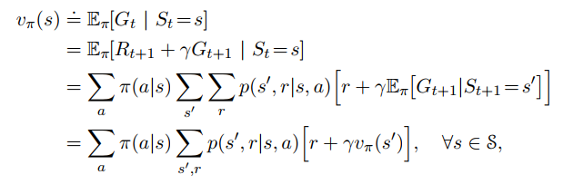

动态规划算法在值函数上的应用，目的是找到最优策略，即实现：

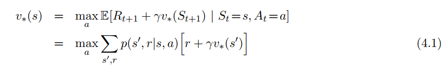

或

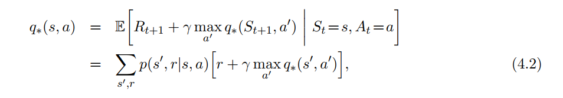

## Policy Evaluation

首先，我们需要考虑的是如何在任意政策$\pi$下，计算值函数$v_{\pi}$。这个过程被称为政策评估(policy evaluation)。我们也把它看作是一个预测问题。参考章节3，可以得到：${\forall}s \in S$，有：

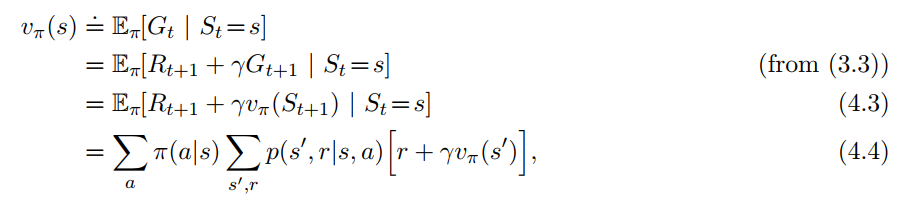

$v_{\pi}$存在且唯一的条件是：$\gamma < 1$或后续状态的策略与当前一致。

如果环境完全可知，式4.4就是一个有$|S|$个方程、每个方程有$|S|$个参数的方程组。

现在我们可以通过下式来递归地获得值的估计：

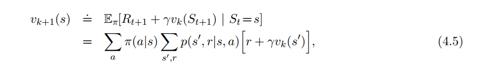

事实上，在任意${v_0}$且$k \to \infty$ 下，序列$\{ v_k \}$能够收敛到${v_{\pi}}$。这个算法叫做递归策略估计(iterative policy evaluation)。

在状态s，从$v_k$到$v_{k+1}$的迭代方式是：上一次下一个状态$s'$的状态值加上本次奖励，就是本次的状态值。我们把这种操作称为全备份(full backup)。在动态规划算法中，更新的值是基于下一个状态的所有可能，而不是下个状态的某几个可能。

基于公式4.5进行策略估计的迭代，我们可能需要两个数组来存储数据：一个存放旧值$v_k(s)$，一个存放新值$v_{k+1}(s)$。用这种方法，新值的更新可以不改变旧值。当然，也可以使用一个数组来存储，旧值总是立即被新值取代。后者的收敛速度要比前者快。

另一个焦点是算法应该何时停止。事实上，迭代的次数必须是有限的。一个办法是如果$|v_{new} - v_{old}| < \theta$，那么迭代就可以停止。

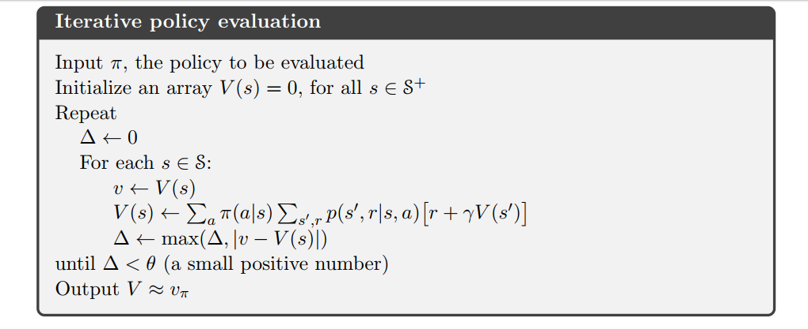

### Example 4.1

有一个如下图所示的4x4的网格：

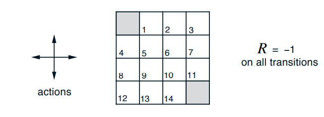

非终结态是$S = {1, 2, ……, 14}$。每个状态可选的行为有$A = {up,down,right,left}$。如果碰壁（下个状态不在S中），那么位置不变。这是一个无折扣、周期性的任务。除了到达终点（终结状态），每次移动获得的奖励都是0。策略是随机平衡策略，即选择行为的概率都是0.25。图4.1是迭代过程。

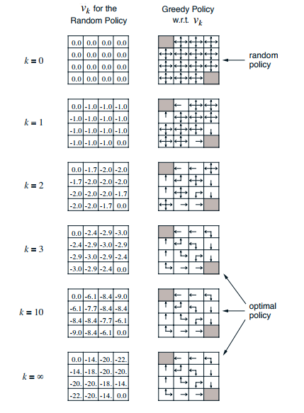

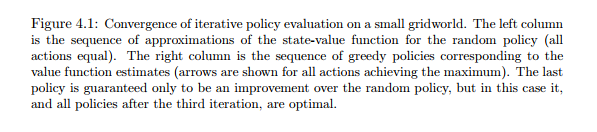

### Exercise 4.1

Q: 设策略是随机策略，$q_{\pi}(11, down)$是多少？$q_{\pi}(7, down)$是多少？

A:

$q_{ \pi } { (11, down ) } = { P ( s', r| s, a )} ( R + { \gamma { v_{\pi} (s')}} ) = 1 * { (-1) + 1 * 0} = -1$

$q_{ \pi } { (7, down ) } = { P ( s', r| s, a )} ( R + { \gamma { v_{\pi} (s')}} ) = 1 * {( -1) + { v_{ \pi } { (11) }}} = -1 + { v_{ \pi} {(11)}}$

### Exercise 4.2

Q: 在随机策略下，$ v_{\pi} {(15)}$是多少？假设智能体从13移动到15，策略不变，此时$ v_{\pi} {(15)}$是多少？

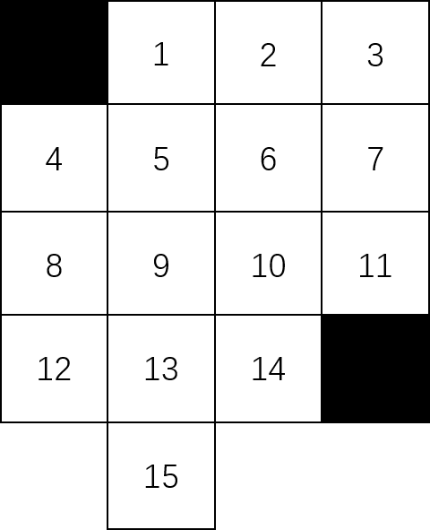

A:

$ v_{\pi} {(15)} = 0.25 ({-1 + v_{\pi} {(15)}}) + 0.25 ({-1 + v_{\pi} {(15)}}) + 0.25 ({-1 + v_{\pi} {(15)}}) + 0.25 ({-1 + v_{\pi} {(13)}}) $

$= -1 + { \frac {3} {4} v_{\pi} {(15)} } + { \frac {1} {4} v_{\pi} {(13)} }$

$ v_{\pi} {(15)} = 0.25 ({-1 + v_{\pi} {(15)}}) + 0.25 ({-1 + v_{\pi} {(15)}}) + 0.25 ({-1 + v_{\pi} {(15)}}) + 0.25 ({-1 + v_{\pi} {(13)}}) $

$= -1 + { \frac {3} {4} v_{\pi} {(15)} } + { \frac {1} {4} v_{\pi} {(13')} }$

### Exercise 4.3

Q: 根据公式4.3，4.4，4.5。求$q_0, q_1, q_2, ……​$

A: 

$$ q_{ k + 1} {(s)} = {\sum}_{s',r} { P { (s',r|s,a) } { [ r + { \gamma} {v_{k} {(s')}}]}}$$

## Policy Improvement

求出值函数的目的是为了更好的找到最优策略。如果在状态s，存在$a \notin \pi(s)$，那么我们就可以制定这样的策略：在状态s选择行为a，剩下的状态依然遵从策略$\pi$。即：

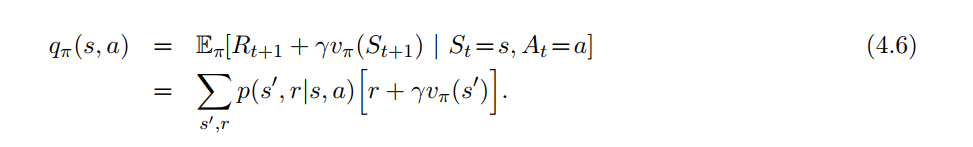

现在如果$q_{\pi}{(s,a)} > {v_{\pi}{(s)}}$，那么我们就说新策略更好。

存在这样一种特殊情况，即$\exists a \notin v_{\pi}(s),   \forall s \in S, 	q_{\pi} {(s, a)}  \ge v_{\pi}(s)$

设${\pi'}{(s)} = a$，即可得：

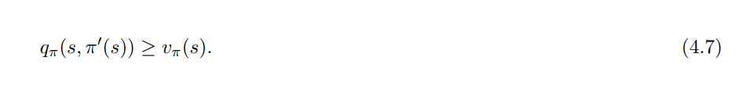

可改写成：

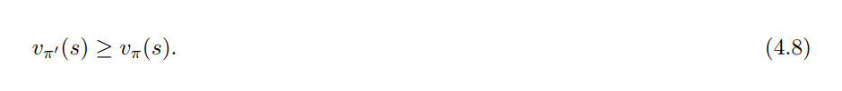

如果新策略满足式4.7，那就一定存在一条新策略优于当前策略。

下面证明为什么在任意$v_0$下，$v_{\pi} \to v_{*}$

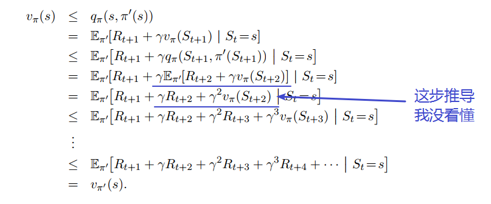

正如我们所见，我们可以很容易的评估在策略$\pi$下，某一特定行为的变化。这样，我们可以考虑新的贪婪策略$\pi'$：

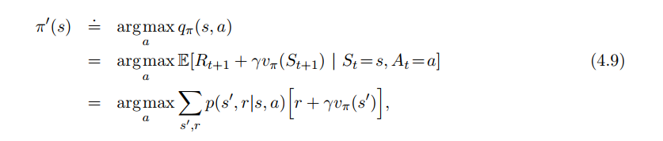

根据策略改进定律(policy improvement theorem)，$\pi'$一定优于或等于$\pi$。通过在最初策略上不断的进行贪婪选择，从而得到新的策略。这种方法被称为策略改进(policy improvement)。

如果$v_{\pi} = v_{\pi'}$，有下列公式：

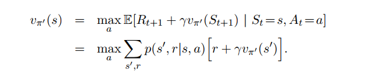

这个式子与贝尔曼最优式相同。此时，$v_{\pi'}$必然是$\pi_{*}$。换句话说，如果策略不再改进，那么这个策略就必然是最优的。

## Policy Iteration

对于任意一个策略$\pi$，我们可以求出$v_{\pi}$来获得更优的策略$\pi'$；接下来，求出$v_{\pi'}$获得更优的$\pi''$，整个流程可以表述为：

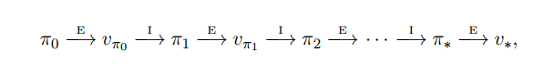

$\stackrel{E}{\to}$表示策略评估，$\stackrel{I}{\to}$表示策略改进。上述流程被称为策略迭代(policy improvement)。

整个策略迭代的流程如下：

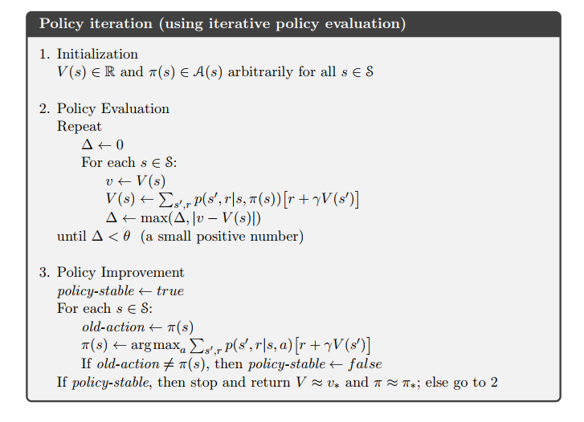

策略迭代的收敛速度很快，可能在几次迭代之后就会收敛。如图4.1所示，左图是在随机策略下的值函数，右图是对应的行为。

### Example 4.2: Jack's Car Rental

杰克管理着两个不同地域的汽车租赁公司。如果某地有可用汽车，那他就盈利10块；如果没有，盈利为0。为了获得最大利润，杰克要调整两地的汽车数量，汽车从A地到B地的花费为2块；反之亦然。设汽车租赁与归还服从泊松分布，两地租赁的$\lambda$分别为3、4，归还的$\lambda$分别为3、2。为简化问题，我们设每地的汽车数量不超过20辆，最大可移动数量为5辆，折扣$\gamma = 0.9$，且问题是一个连续有限的马尔科夫决策过程。以每一天为状态，行为是需要调整的汽车数目。图4.2是从开始到结束的示意图。

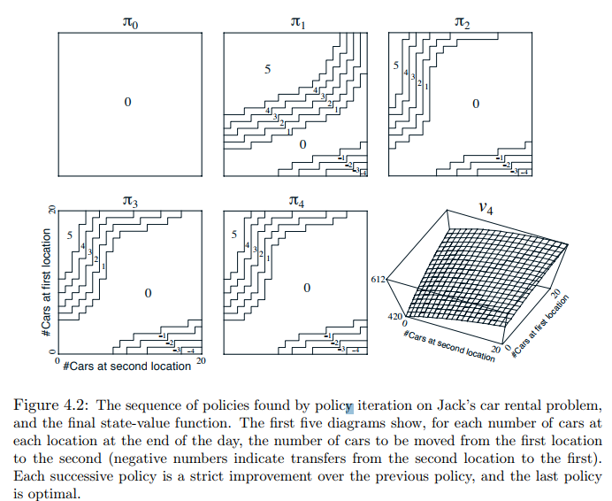

## Value Iteration

策略迭代的一个缺点是每次迭代都要进行策略评估。图4.1表明有一种方法可以减少策略评估的次数。

一个重要的方法是在一次扫描后停止评估。这个算法被称作值迭代(value iteration)。它可以被写成：

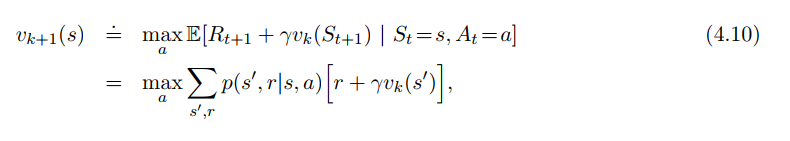

值迭代只是简单地将贝尔曼最优式看作是更新规则。此外，值迭代是在策略评估的基础上的最大值。

现在我们考虑值迭代的终结态。像策略评估，值迭代理论上需要无数次迭代才能收敛到$v_{*}$。实际上，当两次迭代相差很小时，我们就可以停止值迭代。下图式迭代算法：

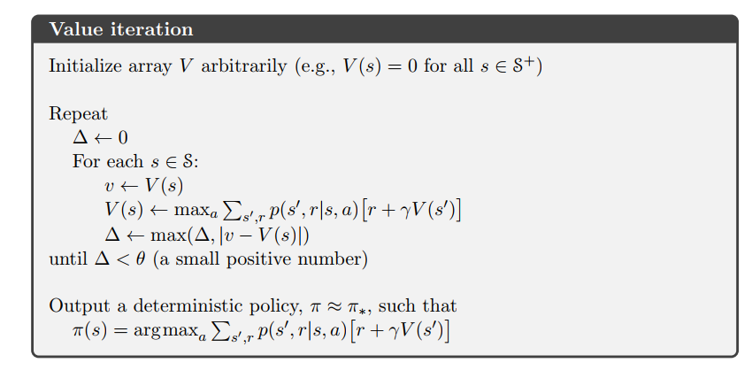

### Example 4.3: Gambler's Problem

一个赌徒根据投硬币的结果来赢得赌注。如果正面朝上，他将获得与他押注金额一样的奖励；否则，他将会失去赌注。如果他获得100块或手里没有赌注，那么游戏结束。在每次游戏的开始，他都要决定压多少赌注。这个问题可以看作是无折扣、周期性、有限的马尔科夫决策过程。状态是赌徒的资本，行为是他押注金额。如果知道硬币正面朝上的概率，整个问题就可以通过值迭代来解决。图4.3是在概率为0.4的情况下的迭代过程。

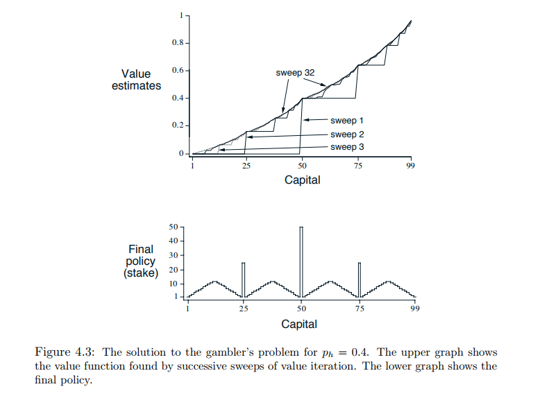

## Asynchronous Dynamic Programming

动态规划算法的一个缺点是我们要对整个状态集合进行处理，这对计算性能有很大的要求。

异步动态算法是替换(in-place)迭代的动态算法，他不需要知道整个状态集合的情况。为了能够正确收敛，异步算法必须不断保存所有状态的值。

当然，避免了整个集合并不意味着我们可以减少计算量。他仅仅表明我们可以不必对那些没有帮助的情况计算。我们可以更灵活的选择状态来提高程序的效率。

异步算法可以很容易的运用在及时交互中。智能体的经验决定哪一个状态应该调用动态规划算法。同时，来自于动态规划算法的最新值和最新策略能够帮助智能体做出决策。

## Generalized Policy Iteration

策略迭代由两个过程组成：交互过程和策略改进。在政策迭代过程中，这两个过程交互进行，一个过程的结束也就是另一个过程的开始，但这不是绝对的。例如，在值迭代算法中，两次策略改进之间，只进行策略评估的迭代。只要这两个过程对所有的状态进行更新，最终结果将是相同的——收敛到最优值函数和最优策略。

我们使用一般策略迭代(generalized policy iteration, GPI)来表述策略评估和策略改进之间进行交互的过程。大部分增强学习算法可以被表述为GPI。对于策略和值函数，策略总是被改进，值函数趋于最优值函数。如下图所示：

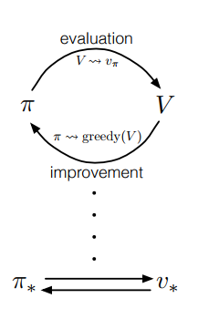

当且仅当值函数的策略是当前策略，那么这个值函数就收敛；当且仅当当前的值函数是贪婪的，那么这个策略就是最优策略。值函数收敛且策略是最优策略，当且仅当值函数是在当前策略下的贪婪表达。根据式4.1，此时的策略和值函数都是最优的。

GPI中评估和改进可以看作是竞争和合作关系。对于值函数采用贪婪行为，无疑会使策略无法达到最优；值函数遵从当前策略不能达到贪婪。总之，在这两个过程的作用下，我们得到最优值函数和最优策略。

也可以从GPI的评估和改进过程在两个限制或目标下的相互作用考虑。如下图的两条直线。每个过程促使值函数或策略向着相反的直线逼近。因为两条线不相交，所以值函数和策略都没有达到最优。不相交的结果导致一个结果向着目标逼近，而另一个结果却开始远离目标。但不可避免的是，整个过程朝着最优化的方向前进。

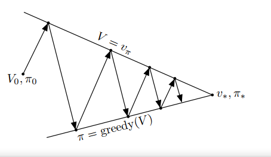

## Efficiency of Dynamic Programming

对于大问题，DP可能不是非常有效，但与MDPs相比，DP还是非常有效的。如果忽略细节，在最坏的情况下，动态规划算法寻找最优策略的时间复杂度是一个关于状态和行为多少的多项式。在这种意义下，动态规划算法要比直接从策略空间搜寻快。线性规划也能够解决MDPs。而且在某种意义上，在最坏的情况下，线性规划要比动态规划好。但线性规划只能用在规模较小的问题上，对于规模较大的问题，只有动态规划算法能够解决。

因为维数诅咒(the curse of dimensionality)，动态规划算法只能有限度的使用。这是因为状态变量可能成指数的形式增加。状态变量的无限增加，是这类问题本身的问题，不是动态规划算法有问题或是动态规划算法导致的。

实际上，凭借现在的计算能力，动态规划算法可以解决含有数百万个状态的MDPs问题。策略迭代和值迭代都已广泛使用。实际上，动态规划算法的所需要的收敛时间要少于理论上的最坏时间，这一点在有理想的初值的情况下尤为明显。

对于状态空间很大的问题，我们常常采用异步动态规划的算法。对于一些问题，它们所需要的内存和计算量是不是实际的。但它们仍然是潜在可解的，因为最优策略可能只涉及很少的状态。异步方法和GPI的其它变形也有可能会比同步方法更快的找到最优解。

