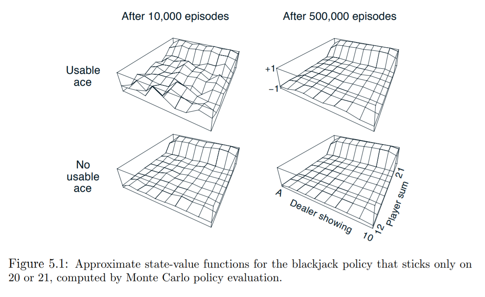
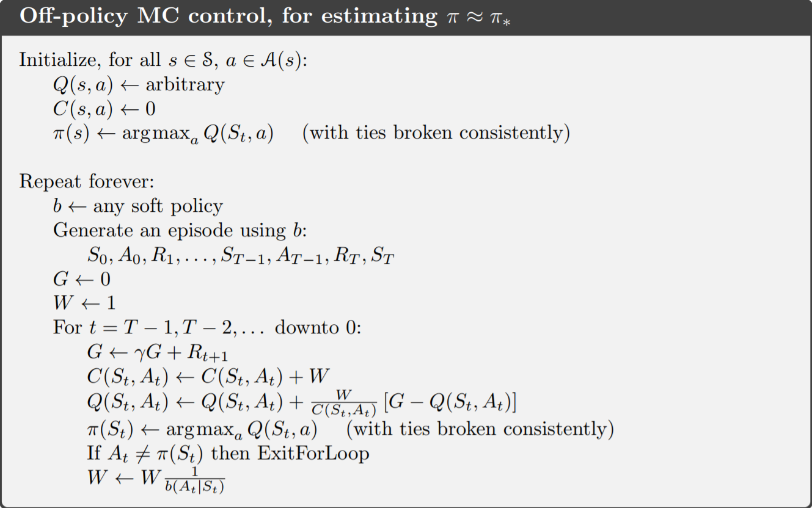
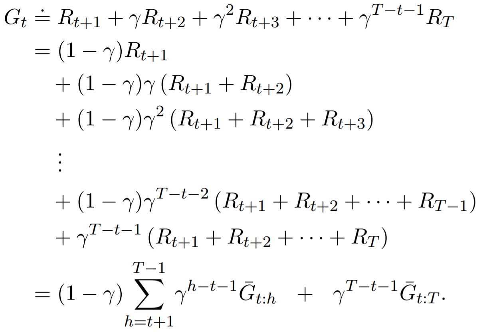

# Chapter 5 Monte Carlo Methods

​	蒙特卡洛算法是一种根据已有经验（样本）来获得最优行为的算法。与之前的算法相比，蒙特卡洛算法不需要环境模型。也就是说，我们可以在不知道环境变化的完整概率分布的情况下获得最优策略。

​	蒙特卡洛算法是一种基于平均样本返回(averaging sample returns)的方法。平均样本返回的定义式是（49页，2.2节）：

​	现在，我们需要用蒙特卡洛算法解决这样一个问题：对于一个周期性任务，在不知道完整概率分布的情况下，利用已有经验（样本），寻找最优策略。任务的一个周期包括价值评估和策略改进。这样，通过一个又一个周期(episode-by-episode)的调整，我们最终获得最优策略。

​	使用蒙特卡洛算法来寻找最优策略在本质上与动态规划算法相同。它们两个都遵从一般策略迭代(general policy iteration, GPI)。也就是说，蒙特卡洛算法的基本流程是：策略评估——策略改进——策略评估——策略改进——……——最优价值函数——最优策略。

## Monte Carlo Prediction

​	我们首先要解决的是如何进行策略评估。显然，如果我们能从样本中找到越多的奖励，那么奖励的平均值就越接近期望值。

​	在一个周期中，每次状态是s，我们就说访问(visit)了一次s。显然，在一个周期中，s状态可能被访问了多次。我们需要注意的是第一次对状态s的访问(first visit to s)。

​	蒙特卡洛算法有两种估计价值函数的方法：首次访问(first-visit)和每次访问(every-visit)。首次访问是指在多个周期内，取每个周期首次处在状态s时获得的回报的和作为分子，可表示为$r = \frac{r_{1,1} + r_{2,1} + ... + r_{n,1}} {n}$。每次访问是指在多个周期内，取每个周期所有处在状态s时获得的回报的总和作为分子，可表示为$r = \frac {r_{1,1} + ... + r_{1,a} + ... + r_{n,1} + ... + r_{n,x}} {a + ... + x}$。

​	首次访问的蒙特卡洛算法如下：

​	首次访问的蒙特卡洛算法和每次访问的蒙特卡洛算法收敛到期望值的条件是：必须访问状态s无数次。

### Blackjack

​	21点的游戏规则是：

1. 点数不可以超过21，否则算输
2. 所有面牌的点数是10
3. A牌的点数是1或11

  ​服务员给玩家和庄家分别发两张牌。其中，一张牌牌面朝上，另一张牌面向下。如果此时玩家手里的牌恰好构成21点，这种情况被称为好运(natural, 这个没有好的[翻译](http://dict.youdao.com/search?q=%20natural&ue=utf8&keyfrom=chrome.extension))，玩家获胜。除非庄家也是同样的情况，此时是平局。如果玩家开始的两张牌没有21点，那么他有两个选择：要牌(hits)和结束(stops)。如果玩家结束要牌，则庄家遵循这样的策略来选择行为：如果点数大于等于17，则结束要牌；否则要牌。

  ​21点游戏显然是一个周期性的有限马尔科夫决策过程。奖励+1、0、-1分别对应玩家赢、平局、输。在游戏中除了结束状态，所有的奖励都是0。此外，$\gamma = 1$。我们假设纸牌的个数是无限，也就是说，下一张牌出现的概率不随牌数的减少而改变。如果把A牌的点数看作是11而不爆牌，这就是一个利用(usable)。

  ​显然，玩家的决策要依据三个方面：他的总点数（12-21），庄家显示的那张牌（1-10或2-11），是否把A牌看作是11点。所有的状态一共有200种。

  初始策略是：如果玩家的点数是20或21，那么结束要牌；否则要牌。我们只有在许多局游戏上应用这个策略，才能得到一个比较准确的平均值。注意我们假设在一局游戏中，玩家和庄家的手里都不会出现相同的牌。最终的测试结果如下图所示：

  ​虽然在这个例子中我们能够完全的知道环境的变化，但我们仍然不能运用DP算法来解决这个问题。DP算法需要知道下个事件的分布，对于21点游戏来说这是不容易做到的。例如，如何求庄家的期望值。蒙特卡洛算法却可以很好的解决这个问题。

  ​蒙特卡洛算法的一个重要特性是每个状态的估计都是独立的。它与DP算法不同，DP算法在某个状态的估计值受其它状态的影响。这个结论可以根据Bellman等式得出来。

  ​既然每个状态的估计都是独立的，那么如果我们只需要某几个状态的估计值，我们就不必像DP算法那样求出所有的状态值。这将会大大加快程序的运行速度。

  ​简言之，蒙特卡罗算法的三个优点是：

4. 不需要环境模型(model-free)，根据经验得到最优解
5. 状态的估计都是独立的
6. 我们可以在不必求出所有状态估计值的情况下，得到某些状态的估计值

### Soap Bubble

​	把一个铁环放到肥皂水里，铁环上就会覆盖上一层水膜。现在的问题是，如何计算水膜的面积？

​	我们知道，水膜上任意一点的高度都可以看作是周围点的高度的平均值。我们可以把水膜划分为一个个格子，每个格子足够的小，可以近似的看作是一个点。边界上的点可以认为和边界的高度相同，其它点的高度是四周点高度的平均值。接下来，我们可以迭代求解网格点的高度。

​	上例与蒙特卡洛算法要解决的问题相似。实际上，如果我们只需要得到某一部分解，蒙特卡洛算法要比递归算法更有效率。

### Exercise 5.1

​	问：读图5.1右图。后面的最后两行值为什么会变大？最后一行的左边，值为什么会变小？为什么前几行的值，上面的要比下面的高？

​	答：在上下两幅图中，越往后，玩家的点数越大。庄家的策略是大于等于17就停止要牌。所以相比之下，越往后，玩家手里的点数越有可能大于庄家。

​	在上下两幅图最后一行的左边，值变小的原因可能是：庄家的点数接近玩家的点数，造成平局。因为最左边表示庄家手里有一张A牌，如果庄家与玩家的点数相差很大，庄家可以把A牌看作是11点；如果相差不大，庄家可以把A牌看作是1点。

​	因为上面的图表示A牌是11点，下面的图表示A牌是1点。**我猜测，如果A牌是11点的话，要抽取的牌数要少于A牌是1点的情况。抽取的牌数越少，越不容易被爆掉。**

## Monte Carlo Estimation of Action Values

​	如果环境模型不可用，估计行为价值会比估计状态价值有用。所以，我们的一个目标是使用蒙特卡洛算法来估计最优行为价值。

​	这里有一个问题，就是在固定策略$\pi$下，我们可能只能得到某个行为的回报，其它行为的信息我们无法从策略$\pi$中获得。

​	一个可能的办法是：从一个特定的状态行为开始，对任意状态$s$，选择任何行为的概率都不等于0。

### Exercise 5.2

问：画出蒙特卡洛算法下，行为值函数的传递图(backup diagram)

答：

## Monte Carlo Control

​	和前面的一样，我们将使用GPI(generalized policy iteration)来求得最优策略。整个流程如下：

​	策略评估的过程如上所述。对于策略改进，我们选择在当前价值函数下，最大函数值对应的行为。也就是$\pi(s) = arg \max_a {q(s,a)}\ \ \ \ \ \ \forall s \in S$。

​	如前所述，策略改进定理保证了$\pi_{k+1}$不差于$\pi_k$。

​	以上的推导过程中，我们作了两个假设：一个是每一个周期的开始我们都指定了状态及所对应的行为；另一个是我们训练了无数多次。

​	我们首先解决第二个假设。一种方法是如果两次评估的改进不大，那么我们就可以停止评估。第二种方法类似于价值迭代，也就是在两次策略改进之间，只进行一次策略评估。

​	对于蒙特卡洛算法，最好的解决方法是进行以周期为单位的评估和迭代。我们首先利用已有的返回进行策略评估，然后改进在本周期出现的所有状态的行为。这样的操作叫做有初始值的蒙特卡洛算法(Monte Carlo ES, Monte Carlo with Exploring Starts)。算法描述如下：

### Solving Blackjack	

下图表示使用有初始值的蒙特卡洛算法求得的21点游戏的最优玩法。

## Monte Carlo Control without Exploring Starts

​	现在，我们来讨论如何去掉第一个假设，即每一个周期的开始我们都指定了状态及所对应的行为。有两种解决方案：同策略(on-policy)和异策略(off-policy)。

​	同策略是使用一条策略进行评估和改进，异策略是评估和改进分别对应不同的策略。

​	对于同策略，我们首先对$\epsilon-greedy$策略进行分析，在逐步扩展到其它软策略($\epsilon-soft$)。异策略在下节讨论。

​	正如我们在第二章讨论的那样，我们有$\epsilon$的概率在所有行为中任意选择，有$1 - \epsilon$的概率选择贪婪行为。根据GPI理论，我们不需要使得所有行为都是贪婪的，我们只要保证策略朝着贪婪策略前进就可以。完整算法如下：

​	现在我们讨论在一般情况下如何求得最优策略，即使用$\epsilon-soft$方法求解。与$\epsilon-greedy$相同，我们有$\epsilon$的概率在所有行为中任意选择，有$1 - \epsilon$的概率选择贪婪行为。我们最终会发现，找到的最优策略与$\epsilon-greedy$方法找到的最优策略一样。

## Off-policy Prediction via Importance Sampling

​	所有的控制方法都面临这样一个困境：我们想要找到后面的最优行为，但是为了探索，我们不得不选择非最优行为。在前面所述的同策略(on-policy)同样面临这样的困境。

​	我们可以想到可以使用两条策略来完成任务：一条用于探索，被称为行为策略(behavior policy)；一条用于学习，被称为目标策略(target policy)。整个过程被称为异策略学习(off-policy learning)

​	如果目标策略和行为策略相同，那么同策略就可以被看作是异策略的一种特殊情况。

​	我们首先要解决的问题是：在目标策略和行为策略不变的情况下，异策略如何对状态的价值进行预测。

​	要解决这个问题，我们必须假设：策略$\pi$的状态行为集与策略$b$的状态行为集的交集不为空。这个假设被称为收敛假设。

​	几乎所有的异策略都会使用关键样本这项技术。关键样本技术指的是在同分布的条件下，使用策略$b$产生的样本来估计策略$\pi$下的状态值。这里有一个概念叫做关键样本率(importance-sampling ratio)，关键样本率是对于两个不同策略产生的行为状态集相交的部分，在策略$\pi$出现的概率与在策略$b$出现的概率的比值。它的定义是为：	

​	因为样本来自于同一个环境模型，所以分子、分母的状态转移概率$p(S_{k+1}| S_k,A_k)$(定义式：$p(S_{k+1}| S_k,A_k) = \sum_{r}P(S_{k+1}, R| S_k,A_k)$)可以消掉。

​	为了方便描述，我们依次对各周期的状态按顺序进行编号。$\tau(s)$表示访问状态s的集合，$T(s)$表示结束状态的集合，$G(t)$表示从状态s到结束状态所获得奖励之和，$\{ \rho_{t: T(t) - 1} \}_{t \in \tau(s)}$表示对应的关键采样率。

​	综上，我们可得：

​	这个式子叫做普通关键采样(ordinary importance sampling)。

​	这个式子叫做加权关键采样(weighted importance sampling)。

​	特别的，如果分母是0，那么$V(s) = 0$。

​	假设关键样本率等于10，这说明在$\pi$策略下更容易出现这样的状态序列。虽然行为策略产生的样本已经非常接近目标策略产生的样本，但实际值要远远大于观测值。

​	普通关键采样和加权关键采样的不同之处在于偏差和方差。普通关键采样是无偏估计，而加权关键采样是有偏估计。另一方面，因为它的关键样本率是无界的，所以普通关键采样的方差一般是无界的；但对于加权关键采样，假设奖励是有界的，那么加权关键采样将会收敛到0，即使关键样本率无界。

### 	Off-policy Estimation of a Blackjack State Value

​	现在我们使用普通关键采样和加权关键采样这两种方法来解决21点游戏中单个状态的价值估计这个问题。假设现在的状态信息是这样的：庄家已知有一张两点的牌，玩家当前的点数是13，玩家有一张点数为11的A牌。行为策略是等概率的选择拿牌或停牌；目标策略是只有在当前点数是20或21时，玩家才选择停牌。

​	在目标策略下，此状态的价值在-0.27726左右。下图是学习曲线。			

​	为了使结果更可靠，我们做了10000次实验，每次实验重复100次。

​	从图中可以看出，两条曲线最后都非常接近0。但是加权关键采样在开始时刻错误率更低。

### Infinite Variance

​	现在有这样一个问题：对于非终结状态状态s，有两个可选行为——向左和向右。向右，下一个状态就一定是终结状态，回报是0。向左，有90%的概率状态不变，回报是0；有10%的概率转移到终结状态，回报是1。

​	显然，最优策略是一直向左，价值的期望是1($\sum_{i = 1} ^ {\infty} {0.9^{i - 1} * 0.1 *1} = 1$ )。现在，行为策略是等概率的向左或向右。

​	从图中可以看到，普通关键采样没有收敛到期望值——1；在最优策略下，加权关键采样能够收敛到期望值。

​	随机变量$X$的数学期望与均值$\bar{X}$之间的偏离程度是：	

​	**PS：[大数定律](https://baike.baidu.com/item/%E5%A4%A7%E6%95%B0%E5%AE%9A%E5%BE%8B)规定，随着重复次数接近无穷大，数值的算术平均值几乎肯定地收敛于期望值。[数学期望——百度百科](https://baike.baidu.com/item/%E6%95%B0%E5%AD%A6%E6%9C%9F%E6%9C%9B)**

​	**PPS：我加上了上面那个条件才推导出书中的式子。也就是$2 \bar{X} E[X] = 2 \bar{X}^2$。不知道我的推导对不对，老师**。

​	根据上式，如果平均值是有限的，那么当且仅当随机变量的平方的期望是无限时，方差才是无限的。

​	本例中，随机变量平方的数学期望可以这么算：因为向右的行为没有回报，所以可以忽略；向左的取值与周期长度有关，概略可以写成$ {(\frac{1} {2} )} ^ i *0.9 ^ {i - 1} * 0.1$，i指的是周期长度。完整计算过程如下：

### Exercise 5.3

​	问：将式(5.5)改写为行为值函数。

​	答：

​	$$Q_{s,a} = \frac {\sum_{t \in \tau(s,a)} \rho_{t:T(t) - 1}G_t} {\sum_{t \in \tau(s,a)} \rho_{t:T(t) - 1}}$$

### 	Exercise 5.4

​	问：在图5.4中，为什么加权关键采样的错误率先增加后减少？

​	答：一开始，加权关键采样是有偏估计。但随着测试的进行，加权关键采样的方差趋于0。

## 	Incremental Implementation

​	对于同策略，我们可以很容易地将其改写为增量改进的形式。对于异策略，我们需要对普通关键采样和加权关键采样分别考虑。

​	对于普通关键采样，我们可以仿照第二章的形式，将奖励值替换为返回值。这样，我们就可以得到同策略的增量改进形式。

​	对于加权关键采样，我们可以写成：

​	$$V_{n+ 1} = V_{n} + \frac{W_n} {C_n}[G_n - V_n] = \frac{V_nC_{n-1} + W_nG_n} {C_n}\ \ \ \ \ n \ge 1$$

​	$$C_{n+1} = C_n + W_{n+1}$$

​	这里$C_0 = 0$，$V_1$是任意值。

​	以下是详细步骤：

​	$V_nC_{n-1} = V_{n-1}C_{n-2} + W_{n-1}G_{n-1}\ \ \ \ \ C_{n-1} = C_{n-2} + W_{n-1}$

​	$\dots$

​	$V_3C_2 = V_2C_1 + W_2G_2\ \ \ \ \ C_2 = C_1 + W_2$

​	$V_2C_1 = V_1C_0 + W_1G_1 = W_1G_1\ \ \ \ \ C_1 = C_0 + W_1 = W_1$

​	通过以上的递归计算，就可求出$V_{n+1}$。

​	下面是异策略蒙特卡洛算法预测过程。	

## Off-policy Monte Carlo Control

​	异策略要求行为策略必须保证选择任意行为的概率大于0，也就是$b(a|s) > 0 \ \ \ \ \ \forall a \in A\ \ \ \ \forall s \in S$。

​	整个算法流程如下：	

​	目标策略贪婪的选择行为，来达到最优；行为策略为保证收敛，必须进行无限次的运行。

​	上述算法存在的问题是：非贪婪行为比贪婪行为更常见。这就导致学习的速度将会非常慢。更严重的是，我们还无法有效的判断这个问题的严重性。

## Discounting-aware Importance Sampling

​	现在我们将折扣$\gamma$引入到异策略中。我们先看这样一个例子：一个周期有100步，且$\gamma = 0$。实际上，此时$G_0 = R_1$。在普通关键采样中，$G_0$只需要与$\frac{\pi(A_0|S_0)} {b(A_0|S_0)}$相乘，与其它99项无关。后面的99项不会影响估计的结果，但会给整个式子带来巨大的方差。在某些情况下，方差甚至会无限大。

​	我们的解决方法是评估当前状态距离结束状态的程度。对于$\gamma \in [0,1)$，$1 -\gamma$表示此时的状态是结束状态的概率，$\gamma$表示此时的状态不是结束状态的概率。这就像是一个打靶问题。击中靶子就结束，未击中的概率是$\gamma$，求射击次数的分布列。所以，此时的回报可以写成：

其中$\bar{G}_{t:h}$为：

​	基于此，普通关键采样可以写成：

​	加权关键采样可以写成：

## Per-reward Importance Sampling

​	在第三章我们通过如下式子来表达我们对未来回报的看法：

​	同样，例如$R_{t+1}$，除$\frac{\pi(A|s)}{b(A|S)}$外，其它重要采样率对估计值无影响，所以我们有以下式子：

​	价值函数可写为：

$\bar{G}_t$的表达式为：

## 	Off-policy Returns

​	时间片误差(temporal-difference error, TD error)的定义为：

​	异策略的状态函数的返回值可以写成：

​	更新公式为：