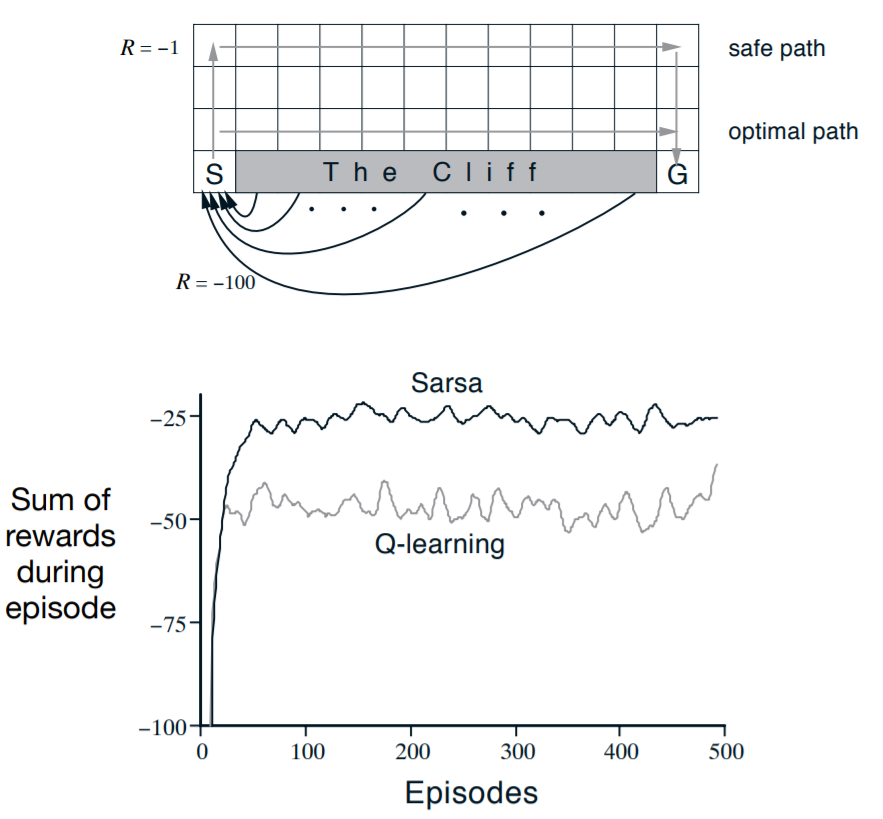

# Chapter 6 Temporal-Difference Learning

时序差分学习(temporal-difference learning, TD learning)完美结合了蒙特卡洛算法和动态规划算法的优点。像蒙特卡洛算法一样，TD算法可以在无环境模型的情况下，直接根据样本学习；像动态规划算法一样，TD算法可以基于部分已学习到的估计更新当前估计，不需要等到过程到达终止状态。

## TD Prediction

TD和蒙特卡洛算法都能够利用样本来解决预测问题。不同的是，蒙特卡洛算法必须等到整个周期结束后，才能得到回报$G_t$。每次访问的蒙特卡洛算法(every-visit Monte Carlo)是:

$$V(S_t) \leftarrow V(S_t) + \alpha [G_t - V(S_t)] \tag{6.1}$$

这里$G_t$表示实际的回报，常数$\alpha$表示步长参数。如上所述，蒙特卡洛算法必须要等到整个周期结束后，才能决定期望$V(S_t)$的增加量。而TD算法只需要等到下一个时间片**（这里我理解为下一个状态）**即可。在$t+1$时刻，我们使用获得的奖励$R_{t+1}$和估计值$V(S_{t+1})$，就能计算出$V(S_t)$的目标值。最简单的TD更新算法如下：

$V(S_t) \gets V(S_t) + \alpha [R_{t+1} + \gamma V(S_{t+1}) - V(S_t)] \tag{6.2}$

在蒙特卡洛算法中，目标值是$G_t$；TD算法中，目标值是$R_{t+1} + \gamma V(S_{t + 1})$。式6.2被称为TD(0)，或者是单步TD(one-step TD)。算法如下：

因为TD(0)的更新与部分已存在的估计值有关，这很容易让我们联想到第三章的引导方法(bootstrapping methods)，像

$$\begin{align} v_{\pi}(s) & \approx E_{\pi}[Gt| S_t = s] \tag{6.3} \\ & = E_{\pi}[R_{t+1} + \gamma G_{t+1} | S_t = s] \tag{from(3.3)}  \\ & = E_{\pi}[R_{t+1} + \gamma v_{\pi}(S_{t+1}) | S_t = s]  \tag{6.4}\end{align}$$

蒙特卡洛算法的目标值是估计值的原因是我们无法知道式6.3的期望值，我们只能用样本的返回值来代替真正的期望值。动态规划算法的目标值是估计值，原因不在于期望值（我们可以假设期望值可以从环境中获得），原因在于$v_{\pi}(S_{t+1})$无法求出，只能用$V({S_{t+1})}$来代替。TD算法的目标值是估计值的原因有两个：一个是它对式6.4的期望值进行采样；另一个是它用当前的估计值$V$代替$v_{\pi}$。

.jpg)

上图是TD(0)的演示图。我们把TD和蒙特卡洛算法的更新看作是样本回归(sample backup)。这两种方法都使用后续状态的估计值和本次的奖励，来计算回归值(backed_up value)，然后使用回归值对原始值进行更新。样本回归与DP算法的全回归的不同之处在于：DP算法依靠单一的样本序列而不是后续状态的完整分布。

现在，我们引入TD误差(TD error)这个概念，公式是:

$$\delta_t \approx R_{t+1} + \gamma V(S_{t+1} - V(S_t)) \tag{6.5}$$

$\delta_t$是$t$时刻的误差。

如果在整个周期中，数组$V$不在更新，蒙特卡洛算法的误差可以写成TD误差的和的形式：

$$\begin{align} G_t - V(S_t) & = R_{t+1} + \gamma G_{t+1} - V(S_t) + \gamma V(S_{t+1}) - \gamma V(S_{t+1}) \tag{from (3.3)}\\ & = \delta_t + \gamma (G_{t+1} - V(S_{t+1}) ) \\ & = \delta_t + \gamma \delta_{t+1} + \dots + \gamma^{T-t-1} \delta_{T-1} + \gamma^{T-t}(0 - 0) \\ & = \sum_{k = t}^{T-1}\gamma^{k-t}\delta_{k} \tag{(6.6)} \end{align}$$

### Exercise 6.1

问：如果$V$在周期中变化，式6.6将是一个近似值。双方之间有什么区别？设$V_t$表示在t时刻的状态值数组，写出蒙特卡洛算法误差的表示式。

答：

pass

### Driving Home

每天你需要估计一下到家需要多长时间。你注意到，花费的时间与天气、周几等因素可能是相关的。某一天是周五，你在下午六点离开办公室，此时你估计可能要三十分钟到家。你到停车场时已经6：05了，这时你注意到可能要下雨了，你估计回家要花费三十五分钟（总计四十分钟）。接下来，你花了十五分钟在高速路上。路况很好，此时你估计你还要十五分钟才能到家。不幸的是，你被堵在一辆行驶很慢的大货车的后面。一直到6：40，你才逃出来。后来你又花了三分钟到家。状态、时间、预测的序列如下表所示：

|            State            | Elapsed Time | Predicted Time to Go | Predicted Total Time |
| :-------------------------: | :----------: | :------------------: | :------------------: |
| leaving office, Friday at 6 |      0       |          30          |          30          |
|     reach car, raining      |      5       |          35          |          40          |
|       exiting highway       |      20      |          15          |          35          |
|  2ndary road, behind truck  |      30      |          10          |          40          |
|    entering home street     |      40      |          3           |          43          |
|         arrive home         |      43      |          0           |          43          |

在本例中，奖励是到下一个状态花费的时间，$\gamma = 1$。状态的值是从此刻开始到回家，花费时间的期望。

左图是蒙特卡洛算法如何预测总时间的示意图。右侧是TD(0)算法。

在本例中，蒙特卡洛算法预计的时间可能与实际的时间有很大的偏差。例如，你认为你只需要15分钟就能离开高速路，实际上你花了23分钟。假设$\alpha = 0.5$，那么我们需要在预计的时间上再加上4分钟（0.5 * （23 - 15））。这个更新幅度太大了，不符合实际。

再假设，你被堵在了半路上。实际上，我们不需要到家（整个周期完成），我们就知道应该上调预期。但根据蒙特卡洛算法，只有到家之后，你才能调整前面的估计值。

但根据TD算法，每一个估计都应该像下一次状态的估计值趋近。在最初的例子中，随着进程的推进，成比例的根据误差对预期进行更新，这被称为预测的时序误差(temporal differences in predictions)。

## Advantages of TD Prediction Methods

TD算法根据部分已知的估计值来估计当前的值。因为TD算法可以直接使用样本进行训练，TD算法不需要环境给出奖励和下个状态的分布律，所以TD算法要优于动态规划算法。

对于蒙特卡洛算法，它必须要等到整个流程结束后，才能得到返回值。而TD算法只需要等到下一个序列就可以知道当前值。假设，某个流程的序列很长或者该任务是一个连续性任务，那么蒙特卡洛算法就会收敛的很慢甚至不能使用。此外，蒙特卡洛算法还要忽略或者可能不重视某些样本。TD算法就没有以上的问题，TD算法从每次状态转移中获得的学习与后续行为的选择无关。

TD算法一定能够收敛到正确值吗？是的，完全可以。对于固定策略$\pi$，步长参数不变且足够小，或者满足随机估计条件($\sum_{n= 1} ^{\infty} \alpha_n (a)  = \infty \ \ \ \ and \ \ \ \ \sum_{n=1}^{\infty} \alpha^2_{n} (a) < \infty$)，TD(0)就能够保证收敛到$v_{\pi}$。

既然TD算法和蒙特卡洛算法都能够收敛到正确值，那么哪种方法收敛的更快？哪种方法更能适应较少的数据？现在还没有一个准确的答案。

### Exercise 6.2

问：

答：

### Exercise 6.3

问：

答：

### Random Walk

现在，我们来比较一下TD(0)算法和蒙特卡洛算法在一个较小序列的马尔科夫决策过程的预测效果。开始状态是C（这个流程的中心），可选行为是等概率的向左或向右。流程将在agent到达最左边或最右边结束。如果结束时agent在最右边，奖励为+1，其它为0。从A到E的真实值是1/6，2/6，3/6，4/6，5/6。下图是流程示意图及实验结果分析。

左图说明TD(0)学习的次数越多，估计值就越接近真实值。基于对多个片段序列的平均，右图表示TD(0)算法和蒙特卡洛算法在预测方面的平均误差。实验中，变量是学习率$\alpha$。程序初始化时，把所有状态的价值设为0.5。从右图我们可以发现，TD算法始终优于蒙特卡洛算法。

### Exercise 6.4

问：

答：

### Exercise 6.5

问：

答：

### Exercise 6.6

问：

答：

## Optimality of TD(0)

假设我们现在只有有限个样本，例如10个片段或者100个序列。这样的情况下，最好的方式就是不停的利用现有的样本迭代，直到收敛。根据式6.1或6.2，价值函数在每次访问序列t被计算，且只被计算一次（通过求所有增加量的和）。然后所有可使用的样本再次被新的价值函数处理，产生新的全局增量，这样往复循环。因为我们在每次处理完一批训练数据后才更新，所以我们称这样的更新方式为批更新（batch updating）。

在批更新的方式下，TD(0)收敛到一个无关步长参数$\alpha$（$\alpha$要足够的小）的值。蒙特卡洛算法也会收敛到一个值，但这个值与TD(0)收敛到的值不等。在正常的更新方式下，两种方法收敛到的值应该相等，虽然它们有分离的迹象。

### Random walk under batch updating

TD(0)和蒙特卡洛算法都可以使用批更新解决随机游走这个问题。每得到一个片段n，我们可以把前n-1个片段看作是一组。这样不断重复，就可以得到收敛的价值函数，并与$v_{\pi}$比较。通过画出前五个状态的方均根差的变化趋势（下图），我们可以得到这样一个结论：TD(0)的批更新总是好于蒙特卡洛算法的批更新。

在批更新的情况下，蒙特卡洛算法收敛到$V(s)$。$V(s)$也是每次访问状态$s$后，实际奖励的平均值。在训练集上，这个值可以保证方均根差最小。为什么TD(0)算法表现的更优？原因是蒙特卡洛算法只可以在有限的方式下达到最优，TD算法达到最优的条件则更多的与预测的返回值有关。

### You are the Predictor

假设有如下片段：

| A,0,B,0 | B,1  |
| :-----: | :--: |
|   B,1   | B,1  |
|   B,1   | B,1  |
|   B,1   | B,0  |

$V(A)$和$V(B)$的值最有可能是多少？在8个片段中 ，有6个片段的B是1，所以我们可以认为$V(B) = \frac{3}{4}$。

但是$V(A)$的最优值是什么？一个答案是$\frac{3}{4}$，因为$V(A)  = R + V(B)$，从A到B的奖励是0，所以$V(A) = V(B)$。它的示意图如下：

另一个答案是$V(A) = 0$。根据马尔科夫算法，我们只访问过A一次，且它的奖励为0，所以$V(A) = 0$。当$V(A) = 0$时，它能够使训练数据的平方差最小。虽然这样，但我们还是认为第一个答案更好一些。

从上例我们可以知道，批处理的马尔科夫算法总是使训练集的方均根差最小；而TD算法总是根据样本来计算马尔科夫决策过程的最大似然估计(maximum-likelihood estimate)。一般来说，一个参数的最大似然估计是产生该数据概率的最大参数值。在这种情况下，最大似然估计以一种显而易见的方式从已有的样本中构成马尔科夫模型：从$i$到$j$的估计概率是样本中从$i$到$j$所占的比例，与此对应的期望奖励是样本中这些转换过程的奖励的平均值。给定一个模型，我们完全可以获得正确的值函数估计。以上可以成为确定等价估计(certainty-equivalence estimate)。一般来说，TD(0)收敛于确定等价估计。

因为TD(0)在计算确定等价估计，所以TD(0)的运算速度要比蒙特卡洛算法快。

最后，即使确定等价估计可能是最优解，但是它几乎不可能直接被使用。如果有N个状态，进行极大似然估计的计算我们可能需要$N^2$的内存，$N^3$个计算步骤。与之相对的，TD算法能够在使用不超过$N$的内存下，使用训练集进行重复迭代，这个效果是非常惊人的。对于状态空间较大的任务，TD算法可能是得到近似确定等价解的唯一方法。

### Exercise 6.7

问：

答：

## Sarsa: On-policy TD Control

与以前一样，TD(0)算法的控制也遵循一般策略迭代(generalized policy iteration)。现在我们来讨论同策略的TD控制过程。

第一步，我们需要学习行为值函数。实际上，对于同策略方法，我们必须在策略$\pi$下，对所有的状态$s$和行为$a$求出估计值$q_{\pi}(s,a)$。回忆一下，一个片段是由一个个状态行为对组成的。它的示意图如下：

它的更新方式为:

$$Q_{t}(S_t, A_t) \gets Q_{t}(S_t, A_t) + \alpha [R_{t +1} + \gamma Q_{t}(S_{t+1}, A_{t+1}) - Q_{t}(S_t, A_t)]  \tag{6.7}$$

这个公式使用一个五元组$(S_t,A_t,R_{t+1},S_{t+1},A_{t+1})$构成一个转换过程，这就是Sarsa算法。状态转换图如下所示：

### Exercise 6.8

问：

答：

我们可以很容易的根据策略$\pi$来获得行为的预测值$q_{\pi}$，并根据获得$q_{\pi}$使$\pi$向贪婪方向前进。Sarsa的算法流程如下：

Sarsa算法的收敛性与策略对$Q$的依赖有关。比如我们使用$\epsilon-greedy$或$\epsilon-soft$策略。只要行为状态对能够被访问无数次且策略能够在有限步内收敛到贪婪，Sarsa就一定能够得到最优策略。

### Windy Gridworld

我们现在对以前的格子世界进行改进：假设在格子的中部有一阵从下向上吹的风，风的强度可以理解为agent被迫向上移动的格子数，风的强度在表格的最下面已标明。每个状态可选的行为有：上、下、左、右。 我们可以把这个任务看作是无折扣的周期任务。除了结束状态、返回值设为-1。

上图是$\epsilon = 0.5, \alpha = 0.5$、初始$Q{(s,a)} = 0$的$\epsilon-greedy$ Sarsa算法的结果。从图中可以看到，即使已训练8000轮，当前策略依然离最优策略有很大的差距。蒙特卡洛算法不能够解决这个任务，因为我们并不能保证对于任意策略可能生成的任何片段都有结束状态。

### Exercise 6.9: Windy Gridworld with King's Moves

问：

答：

### Exercise 6.10: Stochastic Wind

问：

答：

## Q-learning: off-policy TD Control

TD算法的异策略更新规则可以写为：

$$Q_{(S_t,A_t)} \gets Q_{(S_t,A_t)} + \alpha [R_{t+1} + \gamma \max_{a} Q_{(S_{t+1},a)} - Q_{(S_t,A_t)} \tag{6.8}]$$

在这个规则下，行为函数$Q$直接逼近最优行为函数$q*$，而不管它遵循的策略是什么。Q-learning算法如下：

Q-learning的状态转换图如下：

### Cliff Walking

这个例子突出强调同策略和异策略的不同。如果到达被标记为悬崖的区域，奖励为-100，且立即回到开始的地方；除此之外，任何奖励都是-1。下图是它的示意图：

其中$\alpha = 0.1$。Q-learning一开始就遵循最优策略——沿着悬崖的边缘向右走。但由于非贪婪选择的原因，它偶尔会掉下悬崖。Sarsa选择了一条安全的但是更长的路径。虽然Q-learning更接近最优策略，但它的表现要差于Sarsa。当然，如果$\epsilon$逐渐减少，两种方法都会收敛到最优。

### Exercise 6.11

问：

答：

## Expected Sarsa

类似Q-learning，我们把最大值改为期望值，如下：

$$\begin{align}  Q(S_t,A_t) &\gets Q(S_t,A_t) + \alpha [R_{t+1} + \gamma E[Q(S_{t+1} ,A_{t+1} | S_{t+1})] - Q(S_t,A_t) ] \\ &\gets Q(S_t,A_t) + \alpha [R_{t+1} + \gamma \sum_{a} \pi ( a| S_{t+1}) Q(S_{t+1} ,a) - Q(S_t,A_t)] \tag{6.9}                 \end{align}$$

这个算法称为期望Sarsa(expected Sarsa)。它的状态转换图如下：

与Sarsa相比，期望Sarsa消除了随机变量导致的误差。与此同时，期望Sarsa也保留了Sarsa对Q-learning的优势。期望Sarsa可以设$\alpha = 1$而不用担心性能的下降。Sarsa在一个长流程的任务中就必须设定一个较小的$\alpha$，且短期表现不佳。

如果我们使用一个不同的策略来生成片段，期望Sarsa就变成异策略算法。比如$\pi$是一个贪婪策略，它尽可能的去探索。那么此时期望Sarsa就类似于Q-learning，它包含了Q-learning并改善了Sarsa。

## Maximization Bias and Double Learning

