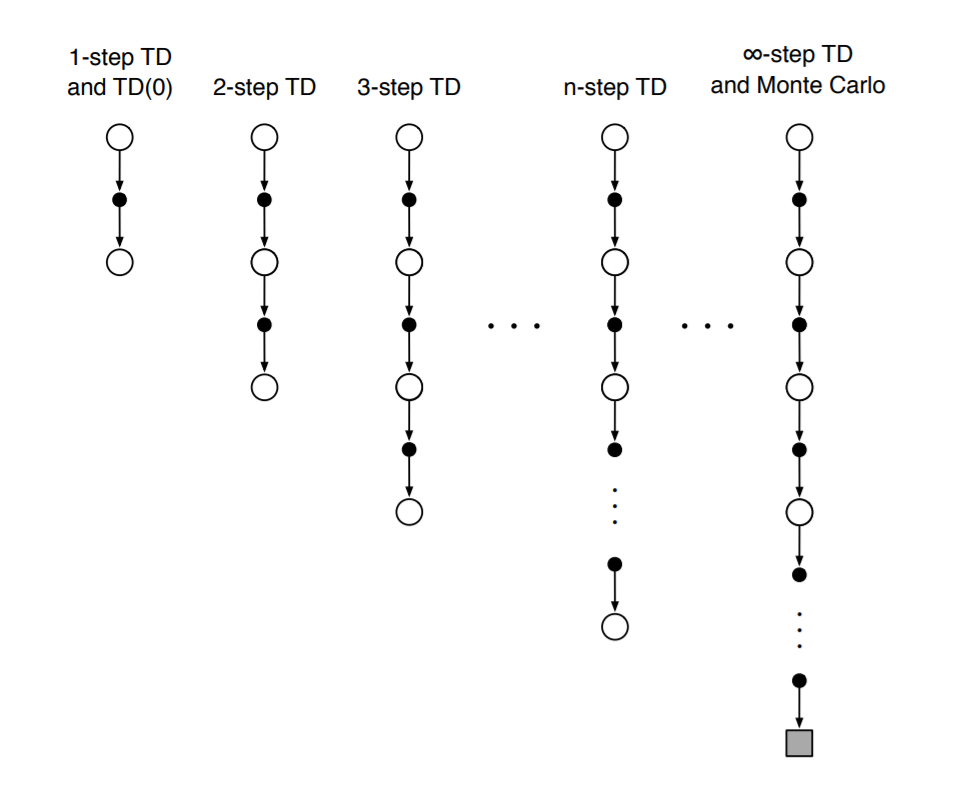
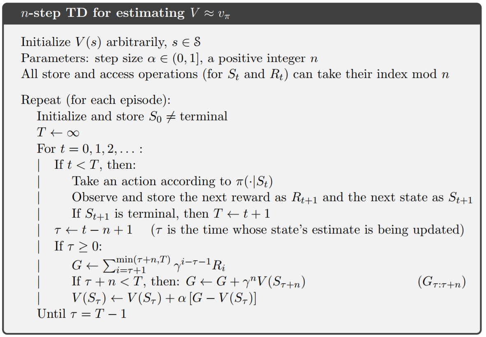
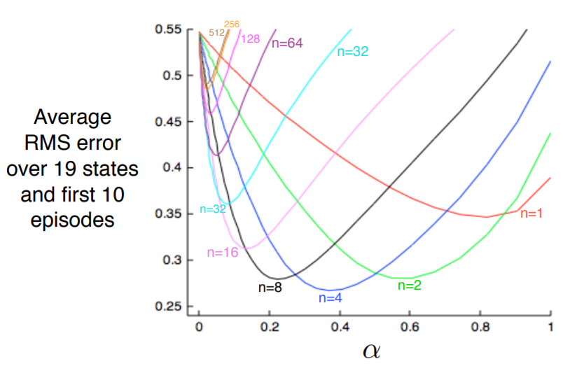
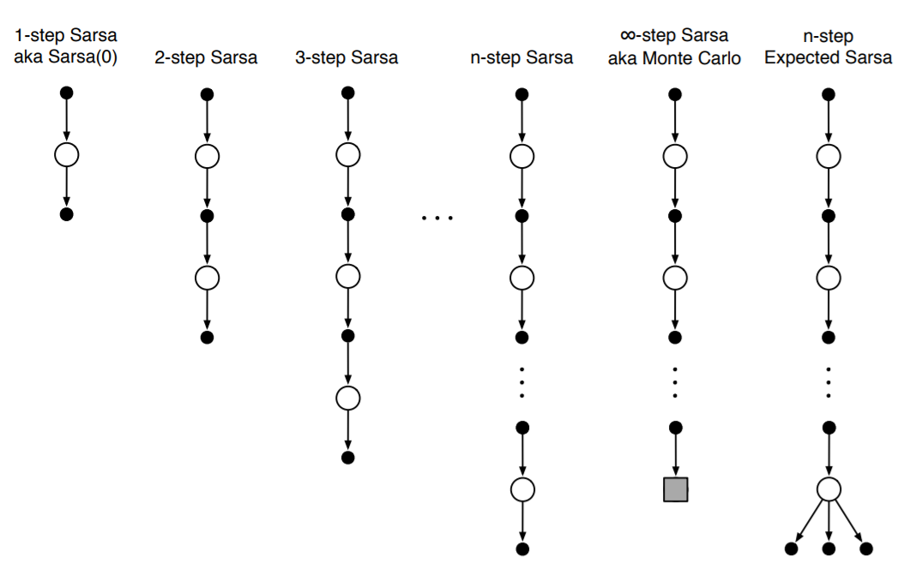
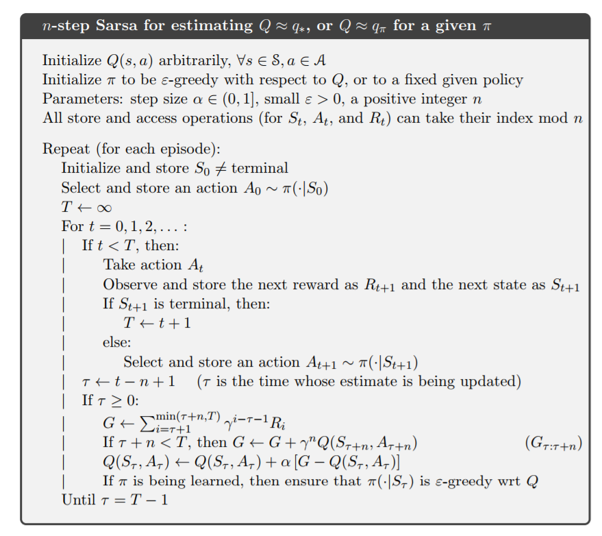
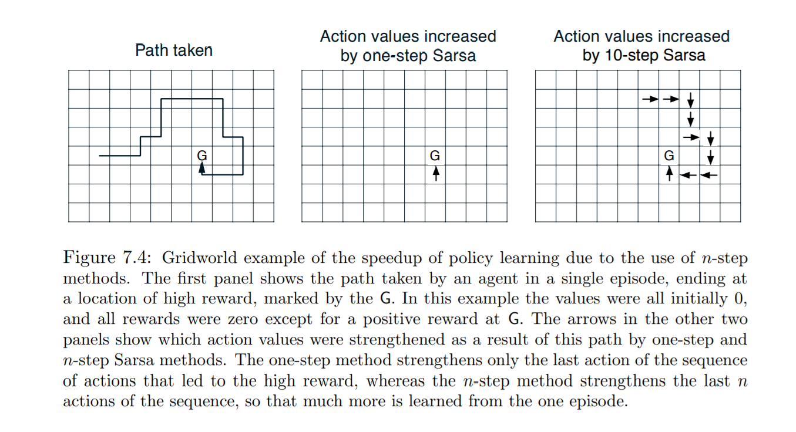
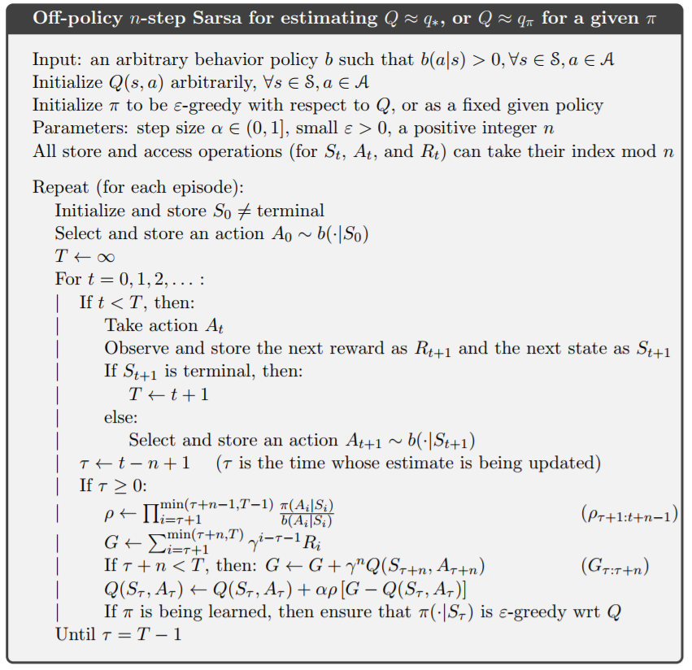

# Chapter 7 Multi-step Bootstrapping

在前两章我们介绍了蒙特卡洛算法和TD算法，其实这两种算法都不是最优的。现在我们介绍一种多步TD算法，这种算法可以随意的变换到TD(0)算法或蒙特卡洛算法。多步TD算法有着比蒙特卡洛算法和TD(0)算法更好的表现。

多步TD算法的另一个好处是它可以使我们不必为单个时间片产生的麻烦而烦恼。在许多应用中，人们希望能够快速的更新行为来获得事物改变的原因，所以更新程序的时间片足够长，那么它就越可能包含有明显作用的状态改变的这一过程，那么更新程序的效果就越好。多步TD算法可以使我们不必为单个时间片产生的麻烦而烦恼。

与以前一样，我们首先考虑预测问题，然后在考虑控制问题，最后推广到行为价值的预测和控制问题。

## n-step TD Prediction

蒙特卡洛算法是接受直到终止状态的整个奖励序列。单步TD算法接受本次的奖励，对于后续的奖励，使用$V(S_{t+1})$来代替。在蒙特卡洛算法和单步TD算法之间，我们可以改变TD算法接受的时间片的长度，使时间片的长度大于1而小于整个奖励序列的长度。例如，两步TD算法，就是接受奖励$R_{t+1} $和$R_{t+2}$，剩下的奖励用$V(S_{t+2})$来代替。同样，我们也可以有三步TD算法、四步TD算法等。

现在我们把三步、四步、……、n步TD算法统称为n-step TD算法。我们可以把单步TD算法和蒙特卡洛算法看作是n步TD算法的特殊形式，n分别对应1和整个奖励序列的长度。

更正式的说，考虑这样一个序列$S_t,R_{t+1},S_{t+1},R_{t+2},\dots,R_T,S_T$，蒙特卡洛算法可以写成$v_{\pi}(S_t) = G_t = R_{t+1} + \gamma R_{t+2} + \dots + {\gamma} ^ {T-t-1} R_T$。

在单步返回中，值的估计是第一个奖励加上折扣乘以下一个状态的价值，公式为$G_{t:t+1} \approx  R_{t+1} + {\gamma} {V_t(S_{t+1})}$。

现在我们可以给出两步TD算法的更新公式可以写成$G_{t:t+2} \approx R_{t+1} + {\gamma} { R_{t+2}} + {\gamma} ^2 {V_{t+1}} (S_{t+2})$。

类似的，我们可以给出n-step TD算法的更新公式：

$G_{t:t+n} \approx R_{t+1} + \gamma R_{t+2} + \dots + \gamma ^{n-1} R_{t+n} + \gamma^n V{t+n-1}(S_{t+n}) \tag{7.1}$

公式(7.1)可以看作是接受n个奖励，剩下的奖励由$V_{t+n-1}(S_{t+n})$代替。如果$t+n > T$，那么缺失项的值设为0，对于该状态，它的值的估计按照蒙特卡洛算法进行计算。

那么，这个n-step TD算法的公式为：

$$V_{t+n}(S_t) \approx V_{t+n-1}(S_t) + \alpha[G_{t:t+n} - V_{t+n-1}(S_t)], \ \ \ \ 0 \le t \le T \tag{7.2}$$

n-step TD算法代码如下：

### Exercise 7.1

问：根据式(7.2)，写出n-step TD算法的误差表示

答：

### Example 7.1: n-step TD Methods on the Random Walk

我们在上一章例6.2介绍了随机游走这个例子。现在我们使用n-step TD算法来解决这个问题。以2步TD算法为例，它将使$V(D)$和$V(E)$趋向于1。如果是3步TD算法，它将使$V(C)$ 、$V(D)$、$V(E)$趋于1。

n取多大最好？下图显示了在更大规模随机游走实验中，n的取值对实验结果的影响。在这个更大的随机游走实验中，总共有19个状态，到达最左边的奖励为-1，剩下的奖励全为0。通过对一些n和$\alpha$的取值，我们得到了如下图所示的实验结果。测量的依据是真实值和预测值之间的平均根方差。从图我们可以看到，蒙特卡洛算法和单步TD算法其实是n-step TD算法的极端情况。

### Exercise 7.3

问：

答：

## n-step Sarsa

如何将n-step TD预测算法应用到控制算法中？我们首先介绍n-step Sarsa。

我们依然使用行为状态对和$\epsilon-greedy$算法对Sarsa算法进行控制。如上所示，类似的，更新公式可以写成：

$$G_{t:t+n} \approx R_{t+1} + \gamma R_{t+2} + \dots + \gamma ^n Q_{t+n-1}(S_{t+n},A_{t+n}), \ \ \ \ n \ge1, \ 0 \le t \le T-n \tag{7.4}$$

如果$t+n \ge T$，那么$G_{t:t+n} \approx G_t$。Sarsa算法可以写成：

$$Q_{t+n} (S_t,A_t) \approx Q_{t+n-1}(S_t,A_t) + \alpha [G_{t:t+n} - Q_{t+n-1} (S_t,A_t], \ \ \ \ {0} {\le} {t} {<} {T}  \tag{7.5}$$

上式就是整个n-step Sarsa算法。

n-step Sarsa算法的表示图可以为：

n-step Sarsa的伪代码如下图所示。

期望Sarsa如何计算？期望Sarsa与n-step Sarsa一致，除了最后一项不是确定的行为状态对，而是行为状态对的期望。在$n \ge 1 \ and \ 0 \le t \le T-n$下，它的更新公式如下：

$$G_{t:t+n} \approx R_{t+1} + \dots + \gamma ^{n-1} R_{t+n} + \gamma ^n \sum_a \pi (a|S_{t+n}) Q_{t+n-1}(S_{t+n},a) \tag{7.6}$$

### n-step Off-policy Learning by Importance Sampling

回忆一下以前的异策略，策略$b$是行为策略，它更多的是对当前状态的探索；策略$\pi$是目标策略，它更多的是贪婪的选择当前状态最大值对应的行为。我们用重要采样率将行为策略和目标策略联系起来。对于n-step算法，它可以写成：

$$V_{t+n}(S_t) \approx V_{t+n-1}(S_t) + {\alpha} \rho_{t:t+n-1} [G_{t:t+n} - V_{t+n-1}(S_t)] \ \ \ \ 0\le t \le T \tag{7.7}$$

这里$\rho_{t:t+n-1}$被称为重要采样率，它的计算公式为：

$$\rho_{t:h} \approx \Pi_{k=t}^{\min(h,T-1)}  \frac{\pi(A_k|S_k)} {b (A_k| S_k)} \tag{7.8}$$

重要采样率可以这样理解：如果某一个行为不会被策略$\pi$采用，那么$\rho = 0$；如果某一行为在$\pi$中选择的概率要比b大，那么我们就可以认为在$\pi$中该状态行为对的价值要比在b中大；如果某一行为在$\pi$中选择的概率要比b小，那么我们就可以认为在$\pi$中该状态行为对的价值要比在b中小。

在加上重要采样率后，上一节的Sarsa算法可以写成：

$$Q_{t+n}(S_t,A_t) \approx Q_{t+n-1}(S_t,A_t) + \alpha \rho_{t+1:t+n-1} [G_{t:t+n} - Q_{t+n-1}(S_t,A_t)] \tag{7.9}$$

现在，我们不必关心我们是如何的选取行为，我们关心的是我们能够从中学习到什么。伪代码如下：

n-step的期望Sarsa使用和Sarsa相同的更新方法，除了期望Sarsa的重要采样率要比Sarsa少一个因子。我们需要将$\rho_{t+1:t+n-2}$代替$\rho_{t+1:t+n-1}$。减少一个因子的原因是，期望Sarsa在最后要考虑所有的行为选择情况，因此不需要进行修正。

